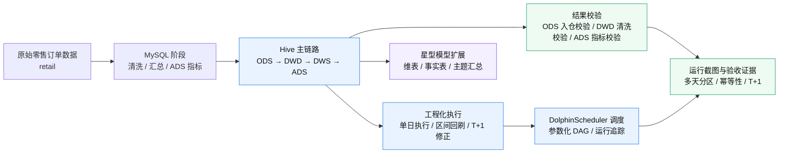
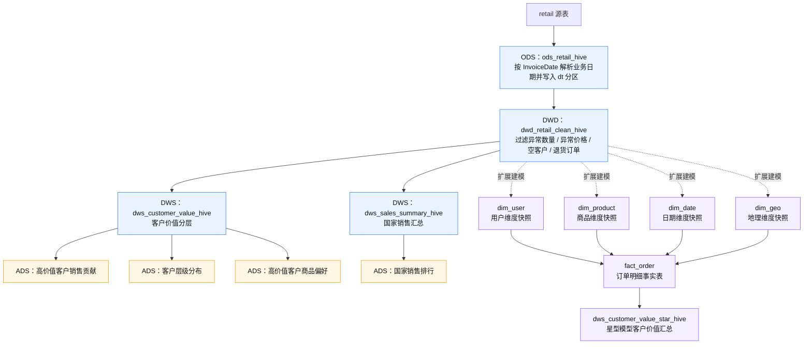

# 零售数据分析离线数仓项目：MySQL、Hive 与 DolphinScheduler 调度实践

## 1. 项目简介

本项目基于电商零售订单数据，围绕订单、客户、商品、国家等维度完成离线数仓建模、业务指标开发、Hive 迁移和 DolphinScheduler 调度编排。

项目分为三个阶段：

1. **MySQL 阶段**：完成订单清洗、主题汇总、应用层指标输出、统一执行脚本、ETL 日志记录和数据质量校验。
2. **Hive 主链路阶段**：将核心链路迁移到 Hive，构建 `ODS -> DWD -> DWS -> ADS` 分层结构，使用 `dt` 分区、ORC 列式存储、`bizdate` 参数和 `INSERT OVERWRITE PARTITION` 分区覆盖写入，支持指定业务日期重跑。
3. **工程化扩展阶段**：补充区间回刷、T+1 修正窗口、ODS 入仓校验、最终结果校验、DolphinScheduler 调度编排，并额外增加 `11-22` 星型模型扩展链路，用于展示维度建模能力。

本项目重点不是单纯写 SQL 查询，而是展示从原始订单数据清洗、客户价值分层、指标沉淀，到 Hive 离线数仓迁移、DolphinScheduler 调度编排和工程化执行的完整实践过程。

---

## 2. 项目架构图

### 2.1 整体工程架构



### 2.2 Hive 数仓主链路与星型模型扩展



说明：`00-09` 是 Hive 主链路，负责完整的 ODS、DWD、DWS、ADS 分层产出；`11-22` 是基于 DWD 的星型模型扩展，用来展示维度建模能力，不替代主链路。

---

## 3. 技术栈

- MySQL
- Hive
- SQL
- HDFS
- ORC
- Linux Shell
- DolphinScheduler
- Docker / 容器化部署
- SSH / Shell 调度执行
- 离线数仓分层建模
- 星型模型维度建模
- 数据质量校验
- ETL 批次日志记录

---

## 4. 项目目录结构

```text
retail_project/
├── README.md
├── sql/
├── hive_sql/
│   ├── 00_ods_retail_hive.sql
│   ├── 00_load_ods_retail_hive.sql
│   ├── 01_dwd_retail_clean_hive.sql
│   ├── 02_load_dwd_retail_clean_hive.sql
│   ├── 03_dws_customer_value_hive.sql
│   ├── 04_dws_sales_summary_hive.sql
│   ├── 05_ads_high_value_customer_sales_contribution_hive.sql
│   ├── 06_ads_customer_level_distribution_hive.sql
│   ├── 07_ads_country_sales_rank_hive.sql
│   ├── 08_ads_high_value_customer_preference_hive.sql
│   ├── 09_check_hive_result.sql
│   ├── 10_check_ods_retail_hive.sql
│   ├── 11_dim_user_scd2_hive.sql
│   ├── 12_load_dim_user_scd2_hive.sql
│   ├── 13_dim_product_hive.sql
│   ├── 14_load_dim_product_hive.sql
│   ├── 15_fact_order_hive.sql
│   ├── 16_load_fact_order_hive.sql
│   ├── 17_dws_customer_value_star_hive.sql
│   ├── 18_load_dws_customer_value_star_hive.sql
│   ├── 19_dim_date_hive.sql
│   ├── 20_dim_geo_hive.sql
│   ├── 21_load_dim_geo_hive.sql
│   ├── 22_load_dim_date_hive.sql
│   ├── run_all_hive.sh
│   ├── run_backfill_hive.sh
│   ├── run_t1_window_hive.sh
│   ├── run_idempotency_check_hive.sh
│   ├── run_star_schema_hive.sh
│   ├── hive_migration_design.md
│   └── interview_hive_talking_points.md
├── dolphinscheduler/
│   ├── dq_check_result.sql
│   ├── etl_task_log_v2.sql
│   ├── hive_task_nodes.md
│   ├── workflow_design.md
│   └── retail_hive_offline_warehouse_daily_demo.json
├── scripts/
│   ├── 10_run_etl.bat
│   ├── 26_scheduler_demo.bat
│   └── run_etl_linux.sh
└── docs/
    ├── 25_scheduler_design.txt
    ├── 27_metric_definitions.txt
    ├── result_screenshots/
    │   ├── 01_ds_workflow_instance_success.png
    │   ├── 02_ds_dag_all_tasks_success.png
    │   ├── 03_ads_sales_contribution_20260408.png
    │   ├── 04_ads_customer_level_distribution_20260408.png
    │   ├── 05_ads_country_sales_rank_20260408.png
    │   ├── 06_ads_customer_preference_20260408.png
    │   └── README.md
    └── result_screenshots_validation/
        ├── 01_7day_ods_partition_check.png
        ├── 02_7day_dwd_partition_check.png
        ├── 03_7day_ads_country_rank_check.png
        ├── 04_idempotency_check_20260403.png
        ├── 05_t1_window_check_20260406_20260407.png
        ├── 06_dwd_cleaning_quality_20260401.png
        └── README.md
```

说明：原始数据文件较大，仓库中不建议上传完整数据集。运行项目前，需要提前准备同字段结构的订单数据表。`scripts/` 目录中的脚本属于 MySQL 阶段的本地执行与调度模拟脚本，不是 Hive 主链路的生产调度入口。

---

## 5. 数据说明

原始表主要字段：

```text
Invoice
StockCode
Description
Quantity
InvoiceDate
Price
CustomerID
Country
```

销售金额字段：

```text
amount = Quantity * Price
```

所有指标默认基于清洗后的有效订单数据统计，不包含异常数量、异常价格、空客户和退货订单。

---

## 6. Hive 主链路设计

Hive 主链路采用 ODS、DWD、DWS、ADS 分层结构，并统一使用 `dt` 作为业务日期分区字段。

```text
retail 源表
  ↓
ods_retail_hive
  ↓
dwd_retail_clean_hive
  ↓
├── dws_customer_value_hive
├── dws_sales_summary_hive
  ↓
├── ads_high_value_customer_sales_contribution_hive
├── ads_customer_level_distribution_hive
├── ads_country_sales_rank_hive
└── ads_high_value_customer_preference_hive
```

核心分区设计：

```sql
PARTITIONED BY (dt STRING)
```

执行任务时通过 `bizdate` 参数传入业务日期：

```sql
'${hiveconf:bizdate}'
```

核心写入方式：

```sql
INSERT OVERWRITE TABLE table_name
PARTITION (dt = '${hiveconf:bizdate}')
```

该方式支持指定业务日期重跑，避免重复执行导致重复数据，并保证离线任务具备幂等性。

---

## 7. Hive 主链路执行脚本

```text
run_all_hive.sh：执行单个 bizdate 的完整主链路
run_backfill_hive.sh：按日期区间循环回刷
run_t1_window_hive.sh：回刷 bizdate 前一天和当天，支持 T+1 延迟数据修正窗口
run_idempotency_check_hive.sh：验收用幂等性检查脚本，重跑指定 bizdate 并对比关键表行数
```

`run_all_hive.sh` 执行顺序：

```text
00_ods_retail_hive.sql
00_load_ods_retail_hive.sql
10_check_ods_retail_hive.sql
01_dwd_retail_clean_hive.sql
02_load_dwd_retail_clean_hive.sql
03_dws_customer_value_hive.sql
04_dws_sales_summary_hive.sql
05_ads_high_value_customer_sales_contribution_hive.sql
06_ads_customer_level_distribution_hive.sql
07_ads_country_sales_rank_hive.sql
08_ads_high_value_customer_preference_hive.sql
09_check_hive_result.sql
```

执行示例：

```bash
sh hive_sql/run_all_hive.sh 2026-04-08
sh hive_sql/run_backfill_hive.sh 2026-04-01 2026-04-08
sh hive_sql/run_t1_window_hive.sh 2026-04-08
sh hive_sql/run_idempotency_check_hive.sh 2026-04-03
```


### 7.1 MySQL 阶段辅助脚本说明

`scripts/` 目录保留的是 MySQL 阶段的本地执行与调度模拟脚本，用于说明项目早期从单机 SQL 执行到日志记录、质量校验和调度模拟的演进过程。它们不参与当前 Hive 主链路的日常执行，也不替代 DolphinScheduler 中的 Hive DAG。

```text
10_run_etl.bat：Windows 本地快速执行 MySQL 版 08_run_all.sql，适合早期本地验证。
26_scheduler_demo.bat：Windows 本地调度模拟脚本，串联 MySQL ETL、日志检查和数据质量检查，主要用于演示调度思路。
run_etl_linux.sh：Linux 环境下执行 MySQL ETL，并写入 START / SUCCESS / FAILED 状态日志，是 MySQL 阶段较完整的工程化执行脚本。
```

面试或项目说明时，建议将 `scripts/` 定位为“MySQL 阶段辅助脚本”，将 `hive_sql/run_all_hive.sh`、`run_backfill_hive.sh`、`run_t1_window_hive.sh` 和 DolphinScheduler DAG 作为当前 Hive 主链路的重点。

---

## 8. 星型模型扩展链路

`11-22` 是基于 DWD 清洗明细补充的星型模型扩展链路，不替代 `00-09` 主链路。

```text
dwd_retail_clean_hive
  ↓
├── dim_user
├── dim_product
├── dim_date
├── dim_geo
  ↓
fact_order
  ↓
dws_customer_value_star_hive
```

执行脚本：

```bash
sh hive_sql/run_star_schema_hive.sh 2026-04-08
```

说明：

- `dim_user` 使用 `md5(customerid|country)` 生成稳定用户代理键。
- `dim_product` 使用 `md5(stockcode)` 生成稳定商品代理键。
- `dim_date` 和 `dim_geo` 用于补充日期维度和地理维度。
- 各维表都使用 `dt` 分区保留每日快照。
- `fact_order` 保留订单明细粒度，使用 `order_line_id` 作为订单明细代理键。
- `dws_customer_value_star_hive` 用于展示基于事实表的客户价值主题汇总，避免和主链路 `dws_customer_value_hive` 表名冲突。

---

## 9. DolphinScheduler 调度设计

工作流名称：

```text
retail_hive_offline_warehouse_daily
```

全局参数：

```text
bizdate = $[yyyy-MM-dd-1]
```

执行方式：DolphinScheduler Shell 节点不在容器内直接执行 Hive，而是通过 SSH 调用部署 Hive 的 Linux 主机执行 Hive SQL。公开仓库中不保留真实服务器账号、真实 IP 或明文密码，统一使用以下占位符：

```text
${HIVE_USER}
${HIVE_HOST}
${PROJECT_HOME}
```

命令模板：

```bash
ssh -o StrictHostKeyChecking=accept-new -o BatchMode=yes ${HIVE_USER}@${HIVE_HOST} "
source /etc/profile
source ~/.bash_profile 2>/dev/null
hive --hiveconf bizdate=${bizdate} -f ${PROJECT_HOME}/hive_sql/SQL文件名
"
```

当前 DolphinScheduler 主链路调度顺序：

```text
ods_create_retail
  -> ods_load_retail
  -> dwd_create_table
  -> dwd_load_clean_data
      -> dws_customer_value
          -> ads_high_value_customer_sales_contribution
          -> ads_customer_level_distribution
          -> ads_high_value_customer_preference
      -> dws_sales_summary
          -> ads_country_sales_rank

ads_high_value_customer_sales_contribution
ads_customer_level_distribution
ads_high_value_customer_preference
ads_country_sales_rank
  -> hive_data_quality_check
```

说明：`10_check_ods_retail_hive.sql` 保留为脚本级 ODS 入仓校验，已在 `run_all_hive.sh` 中执行；DolphinScheduler 示例工作流主要展示主 ETL DAG 和最终质量校验节点。星型模型扩展链路可以单独作为扩展工作流，不建议强行混入主调度 DAG。

---

## 10. 数据质量校验

数据质量校验目标不是只确认 SQL 是否执行成功，而是进一步确认结果表和核心指标是否可用。校验内容包括：

- ODS、DWD、DWS、ADS 各层指定业务日期分区是否有数据；
- ODS 入仓后核心字段空值、数值异常、日期解析失败；
- DWD 清洗后是否仍存在异常数量、异常价格、空客户、空字符串客户、退货订单和异常金额；
- DWS 客户分层结果是否为空、是否合法、边界是否正确；
- ADS 指标表是否生成；
- 指定业务日期 `dt/bizdate` 是否存在结果数据；
- 销售贡献占比、排名、销售额等关键字段是否存在异常范围。

---

## 11. 多天分区运行验证

为证明项目不是只能跑单天样例，本项目额外构造了 `2026-04-01` 到 `2026-04-07` 共 7 天连续业务日期数据，并完成完整链路验证。

验证过程：

```bash
sh hive_sql/run_backfill_hive.sh 2026-04-01 2026-04-07
sh hive_sql/run_idempotency_check_hive.sh 2026-04-03
sh hive_sql/run_t1_window_hive.sh 2026-04-07
```

验证结果：

```text
ODS：2026-04-01 到 2026-04-07，每天 3,202,113 行
DWD：2026-04-01 到 2026-04-07，每天 3,124,956 行
ADS 国家销售排行：2026-04-01 到 2026-04-07，每天 43 行
幂等性验证：通过 run_idempotency_check_hive.sh 重复执行 2026-04-03 后，ODS / DWD / ADS 行数保持一致
T+1 验证：执行 2026-04-07 修正窗口后，2026-04-06 和 2026-04-07 分区结果保持稳定
```

这组验证说明：

- `bizdate` 参数可以稳定驱动多天分区写入；
- `INSERT OVERWRITE PARTITION` 支持同一天重复执行且不产生重复数据；
- `run_idempotency_check_hive.sh` 可以作为验收脚本，用于对比重跑前后关键表行数是否一致；
- `run_backfill_hive.sh` 可以完成连续分区回刷；
- `run_t1_window_hive.sh` 可以完成前一天和当天的延迟数据修正；
- ODS、DWD、ADS 在跨天场景下结果稳定。


---

## 12. 项目亮点

1. 完成 MySQL 到 Hive 的核心指标迁移，形成 ODS、DWD、DWS、ADS 分层主链路。
2. 设计 `dt` 分区、ORC 存储、`bizdate` 参数和 `INSERT OVERWRITE PARTITION`，支持按业务日期幂等重跑。
3. 基于 7 天连续业务日期完成 ODS -> DWD -> ADS 跨天分区验证，并完成单日幂等性和 T+1 窗口验证。
4. 编写 `run_all_hive.sh`、`run_backfill_hive.sh`、`run_t1_window_hive.sh` 和 `run_idempotency_check_hive.sh`，支持单日执行、区间回刷、T+1 修正窗口和幂等性验收。
5. 补充 `10_check_ods_retail_hive.sql` 和 `09_check_hive_result.sql`，覆盖 ODS 入仓校验和最终结果校验。
6. 补充 `11-22` 星型模型扩展链路，展示维度建模、代理键、事实表和维表关联能力。
7. 接入 DolphinScheduler，将 Hive 主链路拆分为可视化 DAG 任务节点，实现参数化调度、运行状态追踪和结果验收。
8. 围绕高价值客户形成客户分层、客户偏好、国家销售排行和销售贡献的完整分析链路。

---

## 13. 运行结果截图

项目运行截图按用途拆分为两个目录，避免把单日 ADS 展示截图和多天分区验证截图混在一起。

### 13.1 调度与 ADS 结果截图

目录：`docs/result_screenshots/`

该目录用于展示 DolphinScheduler 调度状态和 `dt=2026-04-08` 的核心 ADS 结果，主要包括：

```text
01_ds_workflow_instance_success.png
02_ds_dag_all_tasks_success.png
03_ads_sales_contribution_20260408.png
04_ads_customer_level_distribution_20260408.png
05_ads_country_sales_rank_20260408.png
06_ads_customer_preference_20260408.png
```

这些截图用于说明：

- DolphinScheduler 工作流实例可以成功执行；
- 主链路 DAG 中 ODS、DWD、DWS、ADS 和最终校验节点依赖关系清晰；
- `dt=2026-04-08` 的高价值客户销售贡献、客户分层分布、国家销售排行和高价值客户商品偏好等 ADS 指标表可以正常查询。

### 13.2 多天分区与工程能力验证截图

目录：`docs/result_screenshots_validation/`

该目录用于展示 Hive 主链路的多天分区、区间回刷、幂等性和 T+1 修正窗口验证，主要包括：

```text
01_7day_ods_partition_check.png
02_7day_dwd_partition_check.png
03_7day_ads_country_rank_check.png
04_idempotency_check_20260403.png
05_t1_window_check_20260406_20260407.png
06_dwd_cleaning_quality_20260401.png
```

这些截图用于说明：

- `2026-04-01` 到 `2026-04-07` 的 ODS 分区行数稳定；
- `2026-04-01` 到 `2026-04-07` 的 DWD 清洗后分区行数稳定；
- ADS 国家销售排行在连续 7 个业务日期中均能产出结果；
- 重复执行同一业务日期后，关键表行数保持一致，验证 `INSERT OVERWRITE PARTITION` 的幂等性；
- T+1 修正窗口可以回刷前一天和当天分区；
- DWD 清洗校验可以展示异常数量、异常价格、空客户和退货订单等过滤情况。

说明：截图仅作为项目运行验收示例，不作为真实业务运营结论。多天数据用于验证分区回刷能力，不表述为真实业务连续 7 天数据。

---

## 14. 项目边界说明

本项目是面向学习与作品集展示的电商离线数仓项目，主要用于展示 SQL 开发、数仓分层建模、指标沉淀、Hive 迁移、调度编排和数据质量校验能力。项目结果基于当前数据集统计，不等同于真实业务运营指标，也不直接推导实际业务收益。

---

## 15. 运行前准备

运行 Hive 或 DolphinScheduler 调度前，需要完成以下准备：

```text
1. Hive 中已经存在源表 retail，且字段与 README 中的数据说明一致；
2. InvoiceDate 字段格式需要与 Hive SQL 中的日期解析格式保持一致；当前脚本示例主要按 `d/M/yyyy HH:mm:ss` 解析，如源数据为 `yyyy-MM-dd HH:mm:ss`，需要同步调整 ODS、DWD 和星型模型中的日期解析格式；
3. hive_sql/ 目录已部署到 ${PROJECT_HOME}/hive_sql；
4. DolphinScheduler 执行环境已配置 HIVE_USER、HIVE_HOST、PROJECT_HOME；
5. SSH 已配置免密或密钥登录。
```

---

## 16. GitHub 上传说明

公开仓库中不要上传以下内容：

- 真实服务器账号；
- 真实内网 IP 或公网 IP；
- 明文密码；
- 数据库连接凭据；
- 未打码的运行日志截图；
- 大体积原始数据文件。

公开仓库中的调度命令应统一使用占位符形式。实际运行时需要在部署环境中配置 `HIVE_USER`、`HIVE_HOST`、`PROJECT_HOME`，并配置 SSH 免密或密钥登录。
