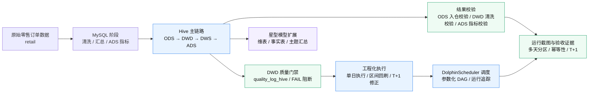
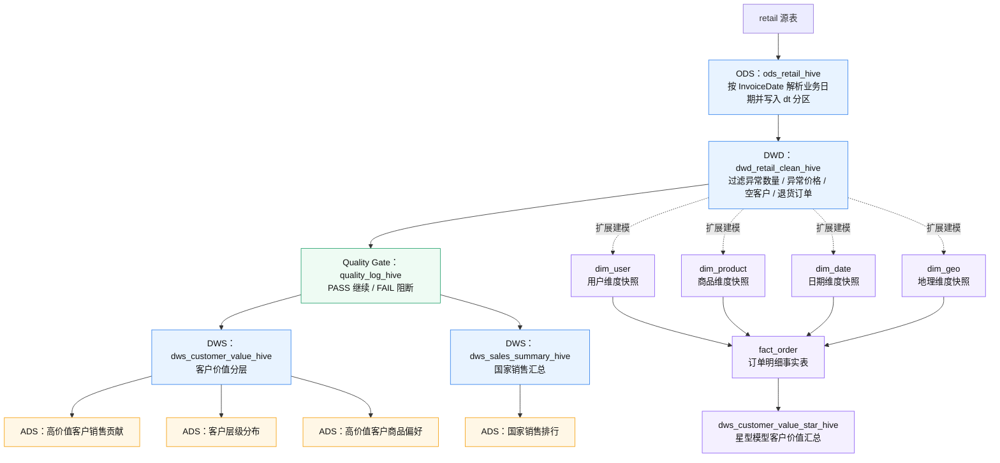

# 零售数据分析离线数仓项目：MySQL、Hive 与 DolphinScheduler 调度实践

## 1. 项目简介

本项目基于电商零售订单数据，围绕订单、客户、商品、国家等维度完成离线数仓建模、业务指标开发、Hive 迁移和 DolphinScheduler 调度编排。

项目分为三个阶段：

1. **MySQL 阶段**：完成订单清洗、主题汇总、应用层指标输出、统一执行脚本、ETL 日志记录和数据质量校验。
2. **Hive 主链路阶段**：将核心链路迁移到 Hive，构建 `ODS -> DWD -> DWS -> ADS` 分层结构，使用 `dt` 分区、ORC 列式存储、`bizdate` 参数和 `INSERT OVERWRITE PARTITION` 分区覆盖写入，支持指定业务日期重跑。
3. **工程化扩展阶段**：补充区间回刷、T+1 修正窗口、ODS 入仓校验、质量日志落表、最终结果校验、DolphinScheduler 调度编排，并额外增加 `11-22` 星型模型扩展链路，用于展示维度建模能力。

本项目重点不是单纯写 SQL 查询，而是展示从原始订单数据清洗、客户价值分层、指标沉淀，到 Hive 离线数仓迁移、DolphinScheduler 调度编排和工程化执行的完整实践过程。

---

## 2. 项目架构图

### 2.1 整体工程架构



### 2.2 Hive 数仓主链路与星型模型扩展



说明：`00-09` 是 Hive 主链路，负责完整的 ODS、DWD、DWS、ADS 分层产出；`11-22` 是基于 DWD 的星型模型扩展，用来展示维度建模能力，不替代主链路。

---

## 3. 技术栈

- MySQL
- Hive
- SQL
- HDFS
- ORC
- Linux Shell
- DolphinScheduler
- Docker / 容器化部署
- SSH / Shell 调度执行
- 离线数仓分层建模
- 星型模型维度建模
- 数据质量校验
- ETL 批次日志记录
- HTML + ECharts（轻量 BI Dashboard）

---

## 4. 项目目录结构

```text
retail_project/
├── README.md
├── sample_data/
│   └── retail_sample.csv           # 最小样例数据，用于验证 Hive 主链路
├── sql/
├── hive_sql/
│   ├── 00_ods_retail_hive.sql
│   ├── 00_load_ods_retail_hive.sql
│   ├── 01_dwd_retail_clean_hive.sql
│   ├── 02_load_dwd_retail_clean_hive.sql
│   ├── 03_dws_customer_value_hive.sql
│   ├── 04_dws_sales_summary_hive.sql
│   ├── 05_ads_high_value_customer_sales_contribution_hive.sql
│   ├── 06_ads_customer_level_distribution_hive.sql
│   ├── 07_ads_country_sales_rank_hive.sql
│   ├── 08_ads_high_value_customer_preference_hive.sql
│   ├── 09_check_hive_result.sql
│   ├── 10_check_ods_retail_hive.sql
│   ├── 11_dim_user_scd2_hive.sql
│   ├── 12_load_dim_user_scd2_hive.sql
│   ├── 13_dim_product_hive.sql
│   ├── 14_load_dim_product_hive.sql
│   ├── 15_fact_order_hive.sql
│   ├── 16_load_fact_order_hive.sql
│   ├── 17_dws_customer_value_star_hive.sql
│   ├── 18_load_dws_customer_value_star_hive.sql
│   ├── 19_dim_date_hive.sql
│   ├── 20_dim_geo_hive.sql
│   ├── 21_load_dim_geo_hive.sql
│   ├── 22_load_dim_date_hive.sql
│   ├── 23_quality_log_hive.sql
│   ├── 24_load_quality_log_hive.sql
│   ├── 25_check_quality_log_hive.sql
│   ├── run_all_hive.sh
│   ├── run_backfill_hive.sh
│   ├── run_t1_window_hive.sh
│   ├── run_idempotency_check_hive.sh
│   ├── run_quality_gate_hive.sh
│   ├── run_star_schema_hive.sh
│   ├── hive_migration_design.md
│   └── interview_hive_talking_points.md
├── retail_bi_dashboard/
│   ├── data/                      # 导出的 Hive ADS 数据 TSV 文件
│   ├── create_dashboard.py         # 生成 HTML Dashboard 的脚本
│   └── dashboard.html              # 生成的轻量 BI Dashboard 页面，可直接打开查看
├── dolphinscheduler/
│   ├── dq_check_result.sql
│   ├── etl_task_log_v2.sql
│   ├── hive_task_nodes.md
│   ├── workflow_design.md
│   ├── deployment_mysql_ssh.md
│   └── retail_hive_offline_warehouse_daily_demo.json
├── scripts/
│   ├── 10_run_etl.bat
│   ├── 26_scheduler_demo.bat
│   └── run_etl_linux.sh
└── docs/
    ├── setup_local_hive.md         # 本地 Hive 运行指南
    ├── 25_scheduler_design.txt
    ├── 27_metric_definitions.txt
    ├── result_screenshots/
    │   ├── 01_ds_workflow_instance_success.png
    │   ├── 02_ds_dag_quality_gate_success.png
    │   ├── 03_dwd_quality_gate_passed.png
    │   ├── 04_ads_sales_contribution_20260408.png
    │   ├── 05_ads_customer_level_distribution_20260408.png
    │   ├── 06_ads_country_sales_rank_20260408.png
    │   ├── 07_ads_customer_preference_20260408.png
    │   ├── 08_light_bi_dashboard_top_20260408.png
    │   ├── 09_light_bi_dashboard_bottom_20260408.png
    │   └── README.md
    └── multiday_validation_screenshots/
        ├── 01_7day_ods_partition_check.png
        ├── 02_7day_dwd_partition_check.png
        ├── 03_7day_ads_country_rank_check.png
        ├── 04_idempotency_check_20260403.png
        ├── 05_t1_window_check_20260406_20260407.png
        ├── 06_dwd_cleaning_quality_20260401.png
        ├── 07_quality_log_20260408.png（可选，用于展示 quality_log_hive 查询结果）
        └── README.md
```

说明：原始数据文件较大，仓库中不建议上传完整数据集。运行项目前，需要提前准备同字段结构的订单数据表。`scripts/` 目录中的脚本属于 MySQL 阶段的本地执行与调度模拟脚本，不是 Hive 主链路的生产调度入口。

轻量级 BI Dashboard 位于 `retail_bi_dashboard/` 目录，`data/` 存放从 Hive ADS 层导出的 TSV 文件，`create_dashboard.py` 用于生成 `dashboard.html`。生成后的 `dashboard.html` 可以直接用浏览器打开查看，不依赖 Superset 或其他重型 BI 工具。

---

## 5. 数据说明

原始表主要字段：

```text
Invoice
StockCode
Description
Quantity
InvoiceDate
Price
CustomerID
Country
```

销售金额字段：

```text
amount = Quantity * Price
```

所有指标默认基于清洗后的有效订单数据统计，不包含异常数量、异常价格、空客户和退货订单。

### 5.1 样例数据

仓库提供最小样例数据：

```text
sample_data/retail_sample.csv
```

该样例数据用于验证 Hive 主链路能否按业务日期完成 ODS、DWD、DWS、ADS 分层产出，不代表完整原始数据集。完整原始数据量较大，公开仓库中不上传全量数据。

本地运行说明见：

```text
docs/setup_local_hive.md
```

最小验证命令：

```bash
cd hive_sql
sh run_all_hive.sh 2026-04-08
```

---

## 6. Hive 主链路设计

Hive 主链路采用 ODS、DWD、DWS、ADS 分层结构，并统一使用 `dt` 作为业务日期分区字段。

```text
retail 源表
  ↓
ods_retail_hive
  ↓
dwd_retail_clean_hive
  ↓
dwd_quality_gate（quality_log_hive，FAIL 阻断）
  ↓
├── dws_customer_value_hive
├── dws_sales_summary_hive
  ↓
├── ads_high_value_customer_sales_contribution_hive
├── ads_customer_level_distribution_hive
├── ads_country_sales_rank_hive
└── ads_high_value_customer_preference_hive
```

核心分区设计：

```sql
PARTITIONED BY (dt STRING)
```

执行任务时通过 `bizdate` 参数传入业务日期：

```sql
'${hiveconf:bizdate}'
```

核心写入方式：

```sql
INSERT OVERWRITE TABLE table_name
PARTITION (dt = '${hiveconf:bizdate}')
```

该方式支持指定业务日期重跑，避免重复执行导致重复数据，并保证离线任务具备幂等性。

---

## 7. Hive 主链路执行脚本

```text
run_all_hive.sh：执行单个 bizdate 的完整主链路
run_backfill_hive.sh：按日期区间循环回刷
run_t1_window_hive.sh：回刷 bizdate 前一天和当天，支持 T+1 延迟数据修正窗口
run_idempotency_check_hive.sh：验收用幂等性检查脚本，重跑指定 bizdate 并对比关键表行数
run_quality_gate_hive.sh：DolphinScheduler DWD 质量门禁，存在 FAIL 时返回非零状态
```

`run_all_hive.sh` 执行顺序：

```text
00_ods_retail_hive.sql
00_load_ods_retail_hive.sql
10_check_ods_retail_hive.sql
01_dwd_retail_clean_hive.sql
02_load_dwd_retail_clean_hive.sql
23_quality_log_hive.sql
24_load_quality_log_hive.sql
03_dws_customer_value_hive.sql
04_dws_sales_summary_hive.sql
05_ads_high_value_customer_sales_contribution_hive.sql
06_ads_customer_level_distribution_hive.sql
07_ads_country_sales_rank_hive.sql
08_ads_high_value_customer_preference_hive.sql
09_check_hive_result.sql
```

执行示例：

```bash
sh hive_sql/run_all_hive.sh 2026-04-08
sh hive_sql/run_backfill_hive.sh 2026-04-01 2026-04-08
sh hive_sql/run_t1_window_hive.sh 2026-04-08
sh hive_sql/run_idempotency_check_hive.sh 2026-04-03
bash hive_sql/run_quality_gate_hive.sh 2026-04-08
hive --hiveconf bizdate=2026-04-08 -f hive_sql/25_check_quality_log_hive.sql
```


### 7.1 MySQL 阶段辅助脚本说明

`scripts/` 目录保留的是 MySQL 阶段的本地执行与调度模拟脚本，用于说明项目早期从单机 SQL 执行到日志记录、质量校验和调度模拟的演进过程。它们不参与当前 Hive 主链路的日常执行，也不替代 DolphinScheduler 中的 Hive DAG。

```text
10_run_etl.bat：Windows 本地快速执行 MySQL 版 08_run_all.sql，适合早期本地验证。
26_scheduler_demo.bat：Windows 本地调度模拟脚本，串联 MySQL ETL、日志检查和数据质量检查，主要用于演示调度思路。
run_etl_linux.sh：Linux 环境下执行 MySQL ETL，并写入 START / SUCCESS / FAILED 状态日志，是 MySQL 阶段较完整的工程化执行脚本。
```

面试或项目说明时，建议将 `scripts/` 定位为“MySQL 阶段辅助脚本”，将 `hive_sql/run_all_hive.sh`、`run_backfill_hive.sh`、`run_t1_window_hive.sh` 和 DolphinScheduler DAG 作为当前 Hive 主链路的重点。

---

## 8. 数据质量日志模块

在 Hive 主链路中补充了一个最小版本的数据质量日志模块，用于把 DWD 清洗质量检查结果沉淀到 Hive 表中。

相关文件：

```text
23_quality_log_hive.sql        创建质量日志表 quality_log_hive
24_load_quality_log_hive.sql   写入指定业务日期的 DWD 清洗质量检查结果
25_check_quality_log_hive.sql  查看指定业务日期的质量日志
run_quality_gate_hive.sh       写入质量日志、统计 FAIL，并向调度平台返回成功/失败状态
```

`quality_log_hive` 记录的核心字段包括：

```text
table_name      被检查表名
check_item      检查项名称
abnormal_cnt    异常数量
check_status    检查状态，PASS 或 FAIL
check_time      检查时间
dt              业务日期分区
```

当前质量模块不做复杂规则系统，只保留最小可落地能力：主链路在 DWD 清洗完成后写入质量日志，主要检查 DWD 层是否仍存在无效数量、无效价格和空客户 ID 等异常数据。`abnormal_cnt = 0` 表示该检查项通过，状态为 `PASS`；否则状态为 `FAIL`。

查看指定业务日期质量日志：

```bash
bash hive_sql/run_quality_gate_hive.sh 2026-04-08
hive --hiveconf bizdate=2026-04-08 -f hive_sql/25_check_quality_log_hive.sql
```

这个模块不仅把检查结果保存到 Hive，还作为 DolphinScheduler 的硬门禁：`failed_count=0` 时返回 0 并允许两个 DWS 分支继续；存在 FAIL 或无法读取检查结果时返回非零状态，阻断后续 DWS/ADS。

---

## 9. 星型模型扩展链路

`11-22` 是基于 DWD 清洗明细补充的星型模型扩展链路，不替代 `00-09` 主链路。

```text
dwd_retail_clean_hive
  ↓
├── dim_user
├── dim_product
├── dim_date
├── dim_geo
  ↓
fact_order
  ↓
dws_customer_value_star_hive
```

执行脚本：

```bash
sh hive_sql/run_star_schema_hive.sh 2026-04-08
```

说明：

- `dim_user` 使用 `md5(customerid|country)` 生成稳定用户代理键。
- `dim_product` 使用 `md5(stockcode)` 生成稳定商品代理键。
- `dim_date` 和 `dim_geo` 用于补充日期维度和地理维度。
- 各维表都使用 `dt` 分区保留每日快照。
- `fact_order` 保留订单明细粒度，使用 `order_line_id` 作为订单明细代理键。
- `dws_customer_value_star_hive` 用于展示基于事实表的客户价值主题汇总，避免和主链路 `dws_customer_value_hive` 表名冲突。

---

## 10. DolphinScheduler 调度设计

工作流逻辑名称：

```text
retail_hive_offline_warehouse_daily
```

已完成的工程配置：

- DolphinScheduler 3.2.2 Docker Standalone；
- 元数据库由 H2 内存库迁移到 MySQL，实现项目、工作流与实例持久化；
- 自定义镜像加入 MySQL Connector/J 与 OpenSSH Client；
- Shell 节点通过 SSH 调用 Hadoop/Hive 主机；
- 12 个节点完整 DAG 已验收成功。

全局参数：

```text
bizdate=$[yyyy-MM-dd-1]
HIVE_USER=<SSH 用户>
HIVE_HOST=<Hive 主机>
PROJECT_HOME=<服务器项目根目录>
```

仓库中的 `hive_sql/` 在服务器部署为 `${PROJECT_HOME}/hive/`，因此普通节点模板为：

```bash
ssh -o StrictHostKeyChecking=accept-new -o BatchMode=yes ${HIVE_USER}@${HIVE_HOST} "
source /etc/profile
source ~/.bash_profile 2>/dev/null || true
hive --hiveconf bizdate=${bizdate} -f ${PROJECT_HOME}/hive/SQL文件名
"
```

质量门禁节点执行：

```bash
bash ${PROJECT_HOME}/hive/run_quality_gate_hive.sh ${bizdate}
```

当前 DAG：

```text
ods_create_retail
  → ods_load_retail
  → dwd_create_table
  → dwd_load_clean_data
  → dwd_quality_gate
      ├→ dws_customer_value
      │    ├→ ads_high_value_customer_sales_contribution
      │    ├→ ads_customer_level_distribution
      │    └→ ads_high_value_customer_preference
      └→ dws_sales_summary
           └→ ads_country_sales_rank

四个 ADS 节点
  → hive_data_quality_check
```

DolphinScheduler 3.2.2 工作流 JSON 导入时，`processTaskRelationList` 必须存在且非空，并使用合法数值任务编码。详细说明见：

- `dolphinscheduler/workflow_design.md`
- `dolphinscheduler/hive_task_nodes.md`
- `dolphinscheduler/deployment_mysql_ssh.md`

---

## 11. 数据质量校验

数据质量校验目标不是只确认 SQL 是否执行成功，而是进一步确认结果表和核心指标是否可用。校验内容包括：

- ODS、DWD、DWS、ADS 各层指定业务日期分区是否有数据；
- ODS 入仓后核心字段空值、数值异常、日期解析失败；
- DWD 清洗后是否仍存在异常数量、异常价格、空客户、空字符串客户、退货订单和异常金额；
- DWS 客户分层结果是否为空、是否合法、边界是否正确；
- ADS 指标表是否生成；
- 指定业务日期 `dt/bizdate` 是否存在结果数据；
- 销售贡献占比、排名、销售额等关键字段是否存在异常范围；
- DWD 清洗质量检查结果是否成功写入 `quality_log_hive`，并能按业务日期查询 PASS / FAIL 状态。

---

## 12. 多天分区运行验证

为证明项目不是只能跑单天样例，本项目额外构造了 `2026-04-01` 到 `2026-04-07` 共 7 天连续业务日期数据，并完成完整链路验证。

验证过程：

```bash
sh hive_sql/run_backfill_hive.sh 2026-04-01 2026-04-07
sh hive_sql/run_idempotency_check_hive.sh 2026-04-03
sh hive_sql/run_t1_window_hive.sh 2026-04-07
```

验证结果：

```text
ODS：2026-04-01 到 2026-04-07，每天 3,202,113 行
DWD：2026-04-01 到 2026-04-07，每天 3,124,956 行
ADS 国家销售排行：2026-04-01 到 2026-04-07，每天 43 行
幂等性验证：通过 run_idempotency_check_hive.sh 重复执行 2026-04-03 后，ODS / DWD / ADS 行数保持一致
T+1 验证：执行 2026-04-07 修正窗口后，2026-04-06 和 2026-04-07 分区结果保持稳定
```

这组验证说明：

- `bizdate` 参数可以稳定驱动多天分区写入；
- `INSERT OVERWRITE PARTITION` 支持同一天重复执行且不产生重复数据；
- `run_idempotency_check_hive.sh` 可以作为验收脚本，用于对比重跑前后关键表行数是否一致；
- `run_backfill_hive.sh` 可以完成连续分区回刷；
- `run_t1_window_hive.sh` 可以完成前一天和当天的延迟数据修正；
- ODS、DWD、ADS 在跨天场景下结果稳定。


### 12.1 Hive 性能优化与回归验证

在不改变主链路表名、分区字段、`bizdate` 参数和 `run_all_hive.sh` 执行顺序的前提下，本项目补充了一轮 Hive 性能优化与全链路回归验证。

本轮优化主要包括：

- **数据倾斜定位**：通过 `country`、`customerid`、`stockcode` 分布检查，发现 `country='United Kingdom'` 在 `dt=2026-04-08` 的 DWD 分区中约 2,175,699 行，占比分区总量约 69.6%，属于典型国家维度数据倾斜。
- **DWS 倾斜处理**：针对 `04_dws_sales_summary_hive.sql` 中的 `GROUP BY country`，将国家销售汇总改造为手写 Salt + 两阶段聚合。销售额先按 `country + salt_key` 局部聚合，再回收为国家粒度；订单数和客户数涉及去重统计，采用先 `country + invoice/customerid` 去重、再按国家汇总的方式，避免 Salt 后重复计数。
- **Join 优化**：针对 `05_ads_high_value_customer_sales_contribution_hive.sql` 和 `08_ads_high_value_customer_preference_hive.sql` 中 DWD 明细大表 Join DWS 客户价值小表的场景，使用 `MAPJOIN` 广播小表，减少 Shuffle 开销。
- **分区裁剪修正**：在 ADS Join 逻辑中补充 `dws.dt='${hiveconf:bizdate}'` 条件，避免跨分区 Join 导致结果重复放大。
- **DWD 清洗修正**：修正 `02_load_dwd_retail_clean_hive.sql` 中清洗条件拼接问题，并补充 `stockcode`、`country`、`invoicedate` 的非空和非空字符串过滤。
- **EXPLAIN 验证**：通过 `EXPLAIN` 确认 ADS Join 查询中出现 `Map Join Operator`，说明 MAPJOIN 生效。
- **全链路回归**：执行 `run_all_hive.sh 2026-04-08` 完成 ODS、DWD、DWS、ADS 和最终质量校验的完整回归，主链路成功结束。

这轮优化的重点不是单纯修改 SQL，而是形成了“发现倾斜 → 定位热点 key → 改写 SQL → EXPLAIN 验证 → 全链路回归”的完整优化闭环。

---

## 13. 项目亮点

1. 完成 MySQL 到 Hive 的核心指标迁移，形成 ODS、DWD、DWS、ADS 分层主链路。
2. 设计 `dt` 分区、ORC 存储、`bizdate` 参数和 `INSERT OVERWRITE PARTITION`，支持按业务日期幂等重跑。
3. 基于 7 天连续业务日期完成 ODS -> DWD -> ADS 跨天分区验证，并完成单日幂等性和 T+1 窗口验证。
4. 编写 `run_all_hive.sh`、`run_backfill_hive.sh`、`run_t1_window_hive.sh` 和 `run_idempotency_check_hive.sh`，支持单日执行、区间回刷、T+1 修正窗口和幂等性验收。
5. 补充 `10_check_ods_retail_hive.sql` 和 `09_check_hive_result.sql`，覆盖 ODS 入仓校验和最终结果校验。
6. 增加 `quality_log_hive` 与 `run_quality_gate_hive.sh`，将 DWD 质量结果按业务日期落表，并通过非零退出码阻断下游 DWS/ADS。
7. 补充 `11-22` 星型模型扩展链路，展示维度建模、代理键、事实表和维表关联能力。
8. 接入 DolphinScheduler 3.2.2，将元数据库由 H2 迁移到 MySQL 持久化，并通过自定义镜像补充 MySQL Connector/J 与 OpenSSH Client，完成 12 节点 DAG 验收。
9. 围绕高价值客户形成客户分层、客户偏好、国家销售排行和销售贡献的完整分析链路。
10. 补充轻量级 BI Dashboard，基于 Hive ADS 层导出数据构建 HTML + ECharts 可视化展示，呈现高价值客户贡献、客户价值分层、国家销售排行和高价值客户商品偏好。
11. 针对 `country` 维度严重倾斜问题，基于 key 分布分析定位热点国家，并在国家销售汇总中使用手写 Salt + 两阶段聚合完成优化。
12. 针对 DWD 大表 Join DWS 小表场景，在高价值客户销售贡献和高价值客户商品偏好 ADS 中使用 MAPJOIN，并通过 EXPLAIN 验证 Map Join Operator 生效。

### 13.1 轻量级 BI Dashboard 说明

轻量级 BI Dashboard 基于 Hive ADS 层导出数据，使用 HTML + ECharts 构建，可展示核心 ADS 指标：

- 高价值客户贡献
- 客户价值分层
- 国家销售排行
- 高价值客户商品偏好

该 Dashboard 为轻量展示页面，不依赖 Superset 或重型 BI 工具，适合项目演示和作品集展示。

---

## 14. 运行结果截图

项目运行截图按用途拆分为两个目录，避免把单日 ADS 展示截图和多天分区验证截图混在一起。

### 14.1 调度与 ADS 结果截图

目录：`docs/result_screenshots/`

该目录用于展示 DolphinScheduler 调度状态、`dt=2026-04-08` 的核心 ADS 结果和轻量级 BI Dashboard 展示截图，主要包括：

```text
01_ds_workflow_instance_success.png
02_ds_dag_quality_gate_success.png
03_dwd_quality_gate_passed.png
04_ads_sales_contribution_20260408.png
05_ads_customer_level_distribution_20260408.png
06_ads_country_sales_rank_20260408.png
07_ads_customer_preference_20260408.png
08_light_bi_dashboard_top_20260408.png
09_light_bi_dashboard_bottom_20260408.png
```

轻量级 BI Dashboard 截图说明：

- `08_light_bi_dashboard_top_20260408.png`：上半部分展示高价值客户贡献、客户价值分层人数和销售贡献占比。
- `09_light_bi_dashboard_bottom_20260408.png`：下半部分展示国家销售排行 Top10 和高价值客户偏好商品 Top10。

### 14.1.1 核心验收截图预览

工作流实例成功：


完整 DAG（含 DWD 质量门禁）：


质量门禁通过：


这些截图用于说明：

- DolphinScheduler 工作流实例可以成功执行；
- 主链路 DAG 中 ODS、DWD、DWS、ADS 和最终校验节点依赖关系清晰；
- `dt=2026-04-08` 的高价值客户销售贡献、客户分层分布、国家销售排行和高价值客户商品偏好等 ADS 指标表可以正常查询；
- 基于 ADS 导出数据生成的轻量级 BI Dashboard 可以集中展示核心指标，适合作为项目演示和作品集展示页。

### 14.2 多天分区与工程能力验证截图

目录：`docs/multiday_validation_screenshots/`

该目录用于展示 Hive 主链路的多天分区、区间回刷、幂等性和 T+1 修正窗口验证，主要包括：

```text
01_7day_ods_partition_check.png
02_7day_dwd_partition_check.png
03_7day_ads_country_rank_check.png
04_idempotency_check_20260403.png
05_t1_window_check_20260406_20260407.png
06_dwd_cleaning_quality_20260401.png
07_quality_log_20260408.png（可选，用于展示 quality_log_hive 查询结果）
```

这些截图用于说明：

- `2026-04-01` 到 `2026-04-07` 的 ODS 分区行数稳定；
- `2026-04-01` 到 `2026-04-07` 的 DWD 清洗后分区行数稳定；
- ADS 国家销售排行在连续 7 个业务日期中均能产出结果；
- 重复执行同一业务日期后，关键表行数保持一致，验证 `INSERT OVERWRITE PARTITION` 的幂等性；
- T+1 修正窗口可以回刷前一天和当天分区；
- DWD 清洗校验可以展示异常数量、异常价格、空客户和退货订单等过滤情况；
- 如果补充 `07_quality_log_20260408.png`，可以展示质量日志表按业务日期落表后的 PASS / FAIL 结果。

说明：截图仅作为项目运行验收示例，不作为真实业务运营结论。多天数据用于验证分区回刷能力，不表述为真实业务连续 7 天数据。

---

## 15. 项目边界说明

本项目是面向学习与作品集展示的电商离线数仓项目，主要用于展示 SQL 开发、数仓分层建模、指标沉淀、Hive 迁移、调度编排和数据质量校验能力。项目结果基于当前数据集统计，不等同于真实业务运营指标，也不直接推导实际业务收益。

---

## 16. 运行前准备

运行 Hive 或 DolphinScheduler 调度前，需要完成以下准备：

```text
1. Hive 中已经存在源表 retail，且字段与 README 中的数据说明一致；
2. InvoiceDate 字段格式需要与 Hive SQL 中的日期解析格式保持一致；当前脚本示例主要按 `yyyy-MM-dd HH:mm:ss` 解析业务日期；
3. 仓库 `hive_sql/` 已部署或挂载到服务器 `${PROJECT_HOME}/hive/`；
4. DolphinScheduler 执行环境已配置 HIVE_USER、HIVE_HOST、PROJECT_HOME；
5. SSH 已配置免密或密钥登录；
6. HDFS NameNode、DataNode 以及 Hive 运行环境已启动，`hdfs dfs -ls /` 和 `hive -e "show databases;"` 可正常返回。
```

---

## 17. GitHub 上传说明

公开仓库中不要上传以下内容：

- 真实服务器账号；
- 真实内网 IP 或公网 IP；
- 明文密码；
- 数据库连接凭据；
- 未打码的运行日志截图；
- 大体积原始数据文件。

公开仓库中的调度命令应统一使用占位符形式。实际运行时需要在部署环境中配置 `HIVE_USER`、`HIVE_HOST`、`PROJECT_HOME`，并配置 SSH 免密或密钥登录。