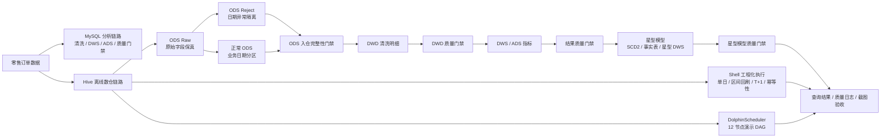
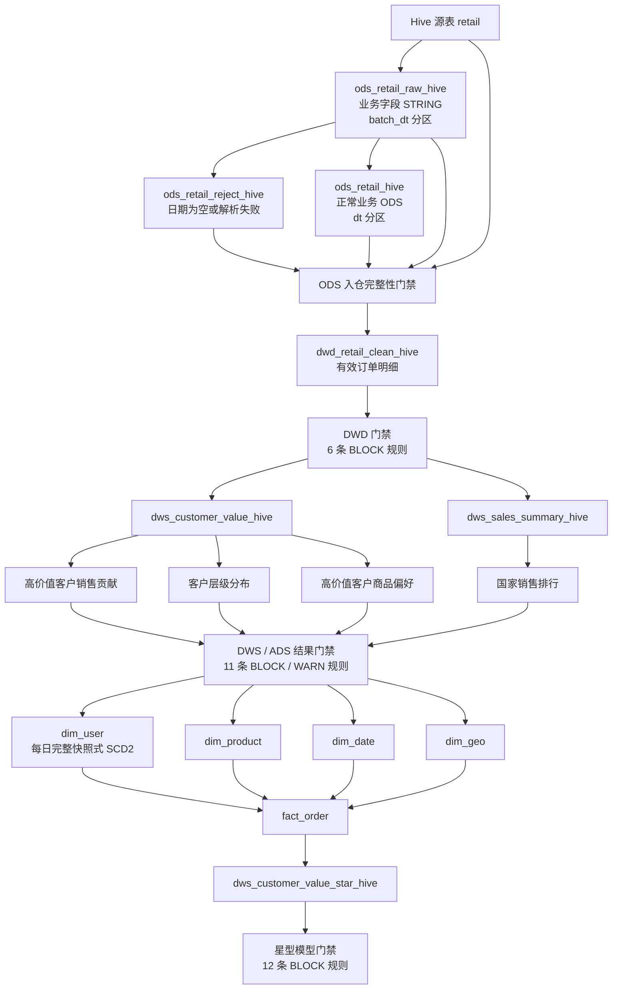

# 零售数据分析离线数仓项目：MySQL、Hive 与 DolphinScheduler 调度实践

## 1. 项目简介

本项目基于电商零售订单数据，围绕订单、客户、商品和国家等维度，完成从 MySQL 数据分析到 Hive 离线数仓迁移，再到 DolphinScheduler 调度编排、数据质量门禁和星型模型扩展的工程实践。

项目当前包含三个阶段：

1. **MySQL 分析阶段**
   完成订单清洗、DWS/ADS 指标开发、统一执行脚本、批次日志，以及 20 项可阻断的数据质量检查。

2. **Hive 主链路阶段**
   构建 `ODS Raw → ODS Reject / 正常 ODS → DWD → DWS → ADS` 分层链路，使用 ORC、日期分区、`bizdate` 参数和 `INSERT OVERWRITE PARTITION` 支持指定业务日期重跑。

3. **工程化与维度建模阶段**
   增加 ODS 入仓完整性门禁、DWD/DWS/ADS/星型模型质量门禁、区间回刷、T+1 修正、内容指纹幂等性检查、每日完整快照式 SCD2 用户维度、订单事实表和 DolphinScheduler 演示 DAG。

本项目重点不是单纯编写 SQL 查询，而是展示以下能力：

- 离线数仓分层建模；
- 原始数据保真与异常分流；
- 上下游行数和金额对账；
- 可重跑、回刷、幂等性和失败阻断；
- ETL 批次级日志追踪；
- SCD2、事实表和星型模型设计；
- 调度编排、性能分析和工程化表达。

> 项目定位为学习和作品集项目。文档会区分“已经实际验证的能力”和“尚未扩展完成的能力”，避免把演示链路描述成生产级系统。

---

## 2. 项目架构

### 2.1 整体工程架构



### 2.2 Hive 完整主链路



### 2.3 MySQL 与 Hive 的关系

```text
MySQL 链路                         Hive 链路
retail                            retail
  ↓                                 ↓
retail_clean / retail_clean2      ODS Raw / Reject / 正常 ODS
  ↓                                 ↓
DWS / ADS                         DWD / DWS / ADS / 星型模型
  ↓                                 ↓
Windows / Linux 调度模拟          Shell / DolphinScheduler
```

MySQL 表和 Hive 表是两个独立系统中的对象。即使二者存在同名表，Hive 也不会自动读取 MySQL 数据。

当前仓库的最小 Hive 复现链路为：

```text
CSV → Hive retail → Hive 数仓链路
```

项目没有内置 MySQL 到 Hive 的自动同步任务。生产环境如需同步，可额外接入 DataX、Sqoop、SeaTunnel 或 DolphinScheduler 数据同步任务。

---

## 3. 技术栈

- MySQL 8.x
- Hive 3.x
- Hadoop / HDFS
- SQL
- ORC
- Bash / Linux Shell
- Windows Batch / PowerShell
- DolphinScheduler 3.2.2
- Docker Standalone
- SSH
- 离线数仓分层建模
- 星型模型与 SCD2
- 数据质量门禁
- ETL 批次日志
- HTML + ECharts 结果截图

> 当前仓库保留轻量 BI Dashboard 的运行截图，但没有包含 Dashboard 生成脚本，因此该部分只能作为已有展示结果，不能从本代码包直接重建。

---

## 4. 项目目录结构

```text
retail_project/
├── README.md
├── .gitignore
├── sample_data/
│   └── retail_sample.csv
├── sql/                                      # MySQL SQL
│   ├── 01_clean.sql
│   ├── 02_basic_analysis.sql
│   ├── 03_window_analysis.sql
│   ├── 04_advanced_analysis.sql
│   ├── 05_dws_layer.sql
│   ├── 06_ads_layer.sql
│   ├── 08_run_all.sql
│   ├── 11_etl_task_log.sql
│   ├── 12_check_etl_log.sql
│   ├── 13_data_quality_check.sql
│   └── 14-22 ADS 扩展指标 SQL
├── scripts/                                  # MySQL 本地执行与调度演示
│   ├── 10_run_etl.bat
│   ├── 26_scheduler_demo.bat
│   └── run_etl_linux.sh
├── hive_sql/                                 # Hive 数仓 SQL 与 Shell
│   ├── 00_bootstrap_sample_source_hive.sql
│   ├── 00_ods_retail_raw_hive.sql
│   ├── 00_load_ods_retail_raw_hive.sql
│   ├── 00_ods_retail_reject_hive.sql
│   ├── 00_load_ods_retail_reject_hive.sql
│   ├── 00_ods_retail_hive.sql
│   ├── 00_load_ods_retail_hive.sql
│   ├── 01-10 ODS / DWD / DWS / ADS SQL
│   ├── 11-22 星型模型 SQL
│   ├── 23-28 质量日志与 BI 导出 SQL
│   ├── run_all_hive.sh
│   ├── run_daily_hive_profiled.sh
│   ├── run_backfill_hive.sh
│   ├── run_t1_window_hive.sh
│   ├── run_idempotency_check_hive.sh
│   ├── check_scd2_backfill_guard.sh
│   ├── run_quality_gate_hive.sh
│   ├── run_result_quality_gate_hive.sh
│   ├── run_star_schema_hive.sh
│   └── run_star_quality_gate_hive.sh
├── dolphinscheduler/
│   ├── retail_hive_offline_warehouse_daily_demo.json
│   ├── workflow_design.md
│   ├── hive_task_nodes.md
│   ├── deployment_mysql_ssh.md
│   ├── dq_check_result.sql
│   └── etl_task_log_v2.sql
└── docs/
    ├── setup_local_hive.md
    ├── 25_scheduler_design.txt
    ├── 27_metric_definitions.txt
    ├── result_screenshots/
    └── multiday_validation_screenshots/
```

目录职责：

```text
sql/       MySQL SQL
scripts/   MySQL 本地执行与调度演示
hive_sql/  Hive SQL、质量门禁和 Shell 主链路
```

运行产生的日志和耗时文件统一写入：

```text
logs/
```

该目录已加入 `.gitignore`，不提交仓库。

---

## 5. 数据说明

原始表主要字段：

```text
Invoice
StockCode
Description
Quantity
InvoiceDate
Price
CustomerID
Country
```

销售金额：

```text
amount = Quantity × Price
```

业务指标默认基于 DWD 清洗后的有效订单统计，不包含：

- 无效数量；
- 无效价格；
- 空客户；
- 取消或退货订单；
- 关键字符串空值；
- 日期无法正常解析的数据。

ODS Raw 和 ODS Reject 属于技术接入与异常追踪层，不直接作为业务指标统计来源。

### 5.1 样例数据

仓库提供最小样例数据：

```text
sample_data/retail_sample.csv
```

该文件用于验证 Hive 源表和数仓脚本能否在独立环境运行，不代表完整原始数据集。全量数据体积较大，公开仓库中不上传。

本地部署说明：

```text
docs/setup_local_hive.md
```

---

## 6. ODS 数据入口设计

### 6.1 ODS Raw 原始落地

表名：

```text
ods_retail_raw_hive
```

设计原则：

- 所有业务字段先按 `STRING` 保存；
- 不在原始落地阶段执行数值强制转换；
- 不根据订单日期提前删除数据；
- 按 ETL 处理批次 `batch_dt` 分区；
- 使用 `INSERT OVERWRITE` 支持同批次安全重跑。

链路：

```text
retail → ods_retail_raw_hive
```

原始层使用字符串的原因是保留真实异常值。例如 `Quantity='abc'` 如果过早转换为整数，只会得到 `NULL`，无法再区分原值为空还是格式错误。

### 6.2 ODS Reject 异常隔离

表名：

```text
ods_retail_reject_hive
```

当前 Reject 规则覆盖：

- `InvoiceDate` 为空；
- `InvoiceDate` 无法按支持格式解析。

支持的日期格式：

```text
yyyy-MM-dd HH:mm:ss
d/M/yyyy HH:mm:ss
```

Reject 表保留：

```text
原始字段
parsed_bizdate
reject_code
reject_reason
batch_dt
```

当前 Reject 尚未扩展到数量和价格格式异常。数量、价格转换后的空值及业务异常仍由正常 ODS 内容检查和 DWD 清洗规则识别。

### 6.3 正常业务 ODS

表名：

```text
ods_retail_hive
```

正常 ODS 不再直接读取源表，而是从 ODS Raw 读取。只有日期能够成功解析且属于当前 `bizdate` 的记录才进入对应 `dt` 分区。

链路：

```text
ods_retail_raw_hive → ods_retail_hive
```

---

## 7. Hive 主链路执行

### 7.1 完整主入口

```bash
bash hive_sql/run_all_hive.sh 2026-04-08
```

当前 `run_all_hive.sh` 共 20 个步骤：

```text
01  创建 ODS Raw 表
02  创建 ODS Reject 表
03  创建正常 ODS 表
04  加载 ODS Raw 分区
05  加载 ODS Reject 分区
06  加载正常 ODS 分区
07  执行 ODS 入仓完整性门禁
08  执行 ODS 内容质量检查
09  创建 DWD 表
10  加载 DWD 分区
11  执行 DWD 质量门禁
12  构建客户价值 DWS
13  构建国家销售 DWS
14  构建高价值客户销售贡献 ADS
15  构建客户层级分布 ADS
16  构建国家销售排行 ADS
17  构建高价值客户商品偏好 ADS
18  执行 DWS / ADS 结果门禁
19  构建星型模型并执行星型模型门禁
20  展示最终结果
```

脚本使用：

```bash
set -Eeuo pipefail
```

任意 SQL 文件、质量门禁或子脚本返回失败时，主链路会立即停止。

### 7.2 其他 Shell 工具

```text
run_backfill_hive.sh
按日期升序执行区间回刷。

run_t1_window_hive.sh
重跑 bizdate 前一天和当天，用于晚到数据或 T+1 修正。

run_idempotency_check_hive.sh
重跑指定日期，并比较 8 张核心 ODS / DWD / DWS / ADS 表的行数和两组 CRC32 指纹。

run_quality_gate_hive.sh
执行 DWD 质量门禁。

run_result_quality_gate_hive.sh
执行 DWS / ADS 结果门禁。

run_star_schema_hive.sh
执行 13 步星型模型链路和最终门禁。

run_star_quality_gate_hive.sh
执行 12 条星型模型规则。

check_scd2_backfill_guard.sh
阻止已有后续快照时单独重跑历史日期。

run_daily_hive_profiled.sh
执行日常链路并记录各步骤耗时，支持局部重跑。
```

执行示例：

```bash
bash hive_sql/run_backfill_hive.sh 2026-04-01 2026-04-08
bash hive_sql/run_t1_window_hive.sh 2026-04-08
bash hive_sql/run_idempotency_check_hive.sh 2026-04-03
bash hive_sql/check_scd2_backfill_guard.sh 2026-04-08
bash hive_sql/run_quality_gate_hive.sh 2026-04-08
bash hive_sql/run_result_quality_gate_hive.sh 2026-04-08
bash hive_sql/run_star_schema_hive.sh 2026-04-08
```

### 7.3 日常运行与局部重跑

表已经创建后，可使用：

```bash
bash hive_sql/run_daily_hive_profiled.sh 2026-04-08
```

该脚本：

- 默认不重复单独执行建表 SQL；
- 默认不执行详细 ODS 样例和最终结果报告；
- 记录每一步和整条链路耗时；
- 支持从指定阶段继续执行。

局部重跑：

```bash
# 从 DWD 开始
bash hive_sql/run_daily_hive_profiled.sh 2026-04-08 dwd

# 从 DWS / ADS 开始
bash hive_sql/run_daily_hive_profiled.sh 2026-04-08 mart

# 从星型模型开始
bash hive_sql/run_daily_hive_profiled.sh 2026-04-08 star
```

可选参数：

```bash
RUN_REPORTS=1 bash hive_sql/run_daily_hive_profiled.sh 2026-04-08
RUN_STAR=0 bash hive_sql/run_daily_hive_profiled.sh 2026-04-08
```

### 7.4 MySQL 阶段辅助脚本

`scripts/` 目录保留 MySQL 阶段的本地执行与调度模拟脚本：

```text
10_run_etl.bat
Windows 本地快速执行 MySQL 版 08_run_all.sql。

26_scheduler_demo.bat
串联 MySQL ETL、批次日志和可阻断数据质量检查。

run_etl_linux.sh
Linux 环境下执行 MySQL ETL，并记录 START / SUCCESS / FAILED 状态。
```

这些脚本不参与 Hive 主链路，也不替代 DolphinScheduler 中的 Hive DAG。

---

## 8. 数据质量体系

项目当前采用：

```text
ODS 入仓完整性门禁
+
DWD / DWS-ADS / 星型模型三级业务质量门禁
```

### 8.1 ODS 入仓完整性门禁

文件：

```text
hive_sql/10_check_ods_ingestion_hive.sql
```

检查：

```text
源表行数 = ODS Raw 行数
预期正常 ODS 行数 = 正常 ODS 实际行数
预期 Reject 行数 = Reject 实际行数
```

使用：

```sql
ASSERT_TRUE(...)
```

断言成立时 Hive 可能显示 `NULL`，这是正常现象；条件不成立时 SQL 会抛出异常并阻断下游任务。

### 8.2 ODS 内容质量检查

文件：

```text
hive_sql/10_check_ods_retail_hive.sql
```

用于展示：

- 正常 ODS 数据量；
- 核心字段空值；
- 数量和价格异常；
- 取消或退货订单；
- Reject 数量和分类；
- 正常及异常样例。

该文件用于数据画像和告警，不承担入仓完整性阻断。

### 8.3 DWD、结果层和星型模型门禁

相关文件：

```text
23_quality_log_hive.sql
创建 DWD 质量日志表。

24_load_quality_log_hive.sql
写入 6 条 DWD 规则。

25_check_quality_log_hive.sql
查询 DWD 规则结果。

27_load_result_quality_log_hive.sql
创建并写入 11 条 DWS / ADS 结果规则。

28_load_star_quality_log_hive.sql
创建并写入 12 条星型模型规则。
```

质量日志主要字段：

```text
rule_code
table_name
check_item
check_level
actual_value
threshold_value
abnormal_cnt
check_status
check_detail
check_time
dt
```

规则处理方式：

- `BLOCK + FAIL`：返回非零状态并阻断下游；
- `WARN + FAIL`：保留告警但不阻断；
- SQL 无法执行或结果无法读取：按门禁失败处理。

#### DWD 门禁

```text
DWD_001 - DWD_006
```

覆盖：

- 无效数量；
- 无效价格；
- 空客户；
- DWD 分区非空；
- ODS 理论有效行数与 DWD 实际行数对账；
- DWD 时间格式标准化。

#### DWS / ADS 结果门禁

```text
RESULT_001 - RESULT_011
```

覆盖：

- DWS 分区非空；
- DWD 与 DWS 销售金额对账；
- 核心 ADS 分区非空；
- 客户数和销售额占比汇总；
- 高价值客户贡献率范围。

#### 星型模型门禁

```text
STAR_001 - STAR_012
```

覆盖：

- SCD2 当前版本唯一性；
- SCD2 日期范围合法；
- 维表业务键唯一；
- 事实表非空；
- DWD 与事实表行数、金额对账；
- `order_line_id` 唯一；
- 事实表与星型 DWS 客户数、金额对账。

项目已验证门禁的成功和失败路径：

- 正常业务日期下，`STAR_001 - STAR_012` 全部通过；
- 空分区测试日期会触发 `STAR_001`、`STAR_008` 失败，并返回退出码 `1`。

---

## 9. 星型模型扩展

`11-22` 是基于 DWD 清洗明细构建的星型模型扩展链路，不替代原 DWS / ADS 指标口径。

```text
dwd_retail_clean_hive
  ↓
├── dim_user
├── dim_product
├── dim_date
└── dim_geo
  ↓
fact_order
  ↓
dws_customer_value_star_hive
  ↓
star_quality_log_hive
```

执行：

```bash
bash hive_sql/run_star_schema_hive.sh 2026-04-08
```

### 9.1 SCD2 用户维度

`dim_user` 保存：

```text
user_id
customerid
country
start_date
end_date
is_current
dt
```

设计逻辑：

- 新客户生成首个版本；
- 属性未变化时延续原版本；
- 属性变化时关闭旧版本并生成新版本；
- 每个 `dt` 分区保存截至当天的完整 SCD2 历史快照；
- 事实表按订单日期匹配有效期内的用户版本，而不是只关联当前版本。

代理键策略：

```text
首日或新版本 user_id：
md5(customerid | country | start_date)

商品 product_id：
md5(stockcode)
```

本次验收环境中，`dim_user` 已确认的实际分区为：

```text
dt=2026-04-08
```

因此当前结果证明首日快照、事实表关联和质量门禁可以运行；连续日期下的多版本属性变化仍需使用真实发生属性变化的数据进一步展示。

### 9.2 历史回刷保护

每日完整快照式 SCD2 存在日期依赖。已经存在更晚快照时，不能只覆盖中间某一天。

执行：

```bash
bash hive_sql/check_scd2_backfill_guard.sh 2026-04-08
```

规则：

- 本次日期等于当前最大分区：允许；
- 本次日期晚于当前最大分区：允许；
- 本次日期早于当前最大分区：阻断，并提示按区间升序回刷。

该保护脚本当前是独立工具，尚未自动接入 `run_all_hive.sh`。

### 9.3 当前星型模型验收结果

`dt=2026-04-08`：

```text
dim_user：5,878 个版本，5,878 个当前版本，5,878 个客户
dim_product：4,630 行，4,630 个唯一商品
dim_date：1 行，1 个唯一日期
dim_geo：41 行，41 个唯一国家
fact_order：2,416,593 行，order_line_id 唯一
DWD / fact_order：行数均为 2,416,593
DWD / fact_order：金额均为 53,230,287.48
STAR_001 - STAR_012：全部 PASS
```

---

## 10. MySQL 阶段

### 10.1 安全认证

项目不在脚本中保存明文密码，而是使用 `mysql_config_editor`：

```powershell
mysql_config_editor set `
  --login-path=retail_local `
  --host=127.0.0.1 `
  --port=3306 `
  --user=root `
  --password
```

测试：

```powershell
mysql --login-path=retail_local retail_project -e "SELECT DATABASE();"
```

### 10.2 Windows 调度模拟

在项目根目录执行：

```powershell
.\scripts\26_scheduler_demo.bat
```

流程：

```text
确认 etl_task_log 存在
→ 写入当前批次 START
→ 执行 08_run_all.sql
→ 执行 20 项数据质量门禁
→ 成功写入 SUCCESS
→ 失败写入 FAILED
→ 只查询当前 batch_id
```

`sql/12_check_etl_log.sql` 使用 `BINARY` 精确匹配批次号，避免会话变量和表字段排序规则不一致导致 `Illegal mix of collations`。

### 10.3 MySQL 数据质量门禁

文件：

```text
sql/13_data_quality_check.sql
```

当前包含 20 项 DWD / DWS / ADS 检查。所有规则先写入临时结果表并统一输出：

```text
check_order
check_name
actual_value
expected_rule
check_status
```

任意规则失败时执行：

```sql
SIGNAL SQLSTATE '45000'
```

使 MySQL 客户端返回非零状态，批处理进入 `FAILED` 分支。

已验证结果：

```text
total_check_cnt   = 20
passed_check_cnt  = 20
failed_check_cnt  = 0
overall_status    = PASS
```

已验证批次日志：

```text
START   = 1
SUCCESS = 1
FAILED  = 0
batch_status = SUCCESS
```

---

## 11. DolphinScheduler 调度设计

工作流逻辑名称：

```text
retail_hive_offline_warehouse_daily
```

### 11.1 已完成的部署实践

项目文档记录了以下部署过程：

- DolphinScheduler 3.2.2 Docker Standalone；
- 元数据库由 H2 内存库迁移到 MySQL，实现项目、工作流和实例持久化；
- 自定义镜像加入 MySQL Connector/J；
- 自定义镜像加入 OpenSSH Client；
- Shell 节点通过 SSH 调用 Hadoop/Hive 主机；
- 12 节点 DAG 已完成成功验收。

详细说明：

```text
dolphinscheduler/deployment_mysql_ssh.md
dolphinscheduler/workflow_design.md
dolphinscheduler/hive_task_nodes.md
```

### 11.2 当前导入 JSON

文件：

```text
dolphinscheduler/retail_hive_offline_warehouse_daily_demo.json
```

当前状态：

- JSON 已通过 Python 标准解析；
- 共 12 个任务节点；
- `schedule` 为 `null`，导入后不会自动创建启用中的定时计划；
- `globalParams`、`globalParamList`、`globalParamMap` 已统一；
- 公开仓库只保存占位参数。

占位值：

```text
bizdate=$[yyyy-MM-dd-1]
HIVE_USER=your_hive_user
HIVE_HOST=your_hive_host
PROJECT_HOME=/home/your_user/retail_hive_project
```

DolphinScheduler 3.2.2 导入文件中：

```text
processTaskRelationList
```

必须存在且非空，并使用合法的数值任务编码，否则工作流关系无法正常导入。

### 11.3 当前 12 节点 DAG

```text
ods_create_retail
→ ods_load_retail
→ dwd_create_table
→ dwd_load_clean_data
→ dwd_quality_gate
   ├─ dws_customer_value
   │  ├─ ads_high_value_customer_sales_contribution
   │  ├─ ads_customer_level_distribution
   │  └─ ads_high_value_customer_preference
   └─ dws_sales_summary
      └─ ads_country_sales_rank

四个 ADS 节点
→ hive_data_quality_check
```

当前 JSON 是已验收的原主链路演示 DAG，尚未同步：

- ODS Raw；
- ODS Reject；
- ODS 入仓完整性门禁；
- DWS / ADS 结果门禁；
- 星型模型；
- 星型模型门禁。

因此应明确区分：

```text
当前最完整执行链路：
hive_sql/run_all_hive.sh

已验收调度演示：
DolphinScheduler 12 节点 JSON
```

导入后应先修改环境参数并手动验证，再根据目标环境时区和业务窗口配置定时计划。

---

## 12. 回刷、T+1 与幂等性

### 12.1 区间回刷

```bash
bash hive_sql/run_backfill_hive.sh 2026-04-01 2026-04-08
```

脚本按日期升序执行，任意一天失败后停止。

### 12.2 T+1 修正

```bash
bash hive_sql/run_t1_window_hive.sh 2026-04-08
```

用于重跑前一天和当天。

### 12.3 内容指纹幂等性检查

```bash
bash hive_sql/run_idempotency_check_hive.sh 2026-04-03
```

当前脚本对 8 张核心 ODS / DWD / DWS / ADS 表比较：

- 行数；
- 第一组 CRC32 内容指纹；
- 第二组反向字符串 CRC32 内容指纹。

该方法用于降低“行数相同但内容发生变化”的漏检风险。它是工程验收指纹，不是密码学哈希。

当前脚本尚未覆盖：

- ODS Raw；
- ODS Reject；
- 全部星型模型表。

---

## 13. 性能分析与 SQL 优化

### 13.1 已完成的 SQL 优化

项目保留了以下 Hive 优化实践：

1. **国家维度数据倾斜识别**
   `country='United Kingdom'` 在一次 DWD 分区中约有 2,175,699 行，占约 69.6%，属于明显热点 Key。

2. **手写 Salt 与两阶段聚合**
   `04_dws_sales_summary_hive.sql` 针对 `GROUP BY country` 使用 Salt。销售额先局部聚合再回收；订单数和客户数采用独立去重路径，避免加盐后重复计数。

3. **MAPJOIN**
   DWD 明细大表关联 DWS 客户价值小表时使用 `MAPJOIN`，减少 Shuffle。

4. **分区裁剪**
   ADS Join 增加 `dws.dt='${hiveconf:bizdate}'`，避免跨日期分区关联导致结果放大。

5. **DWD 清洗修正**
   补充 `stockcode`、`country`、`invoicedate` 非空和非空字符串过滤。

6. **执行计划验证**
   使用 `EXPLAIN` 确认查询中出现 `Map Join Operator`。

该过程形成：

```text
发现倾斜
→ 定位热点 Key
→ 改写 SQL
→ EXPLAIN 验证
→ 全链路回归
```

### 13.2 全链路耗时分析

一次单机虚拟机完整日常链路实测：

```text
TOTAL_PIPELINE：1963 秒，约 32 分 43 秒
```

主要耗时：

```text
星型模型链路                    758 秒
DWS / ADS 结果质量门禁          237 秒
ODS 入仓完整性门禁              151 秒
DWD 质量门禁                    130 秒
国家销售 DWS                    109 秒
高价值客户商品偏好 ADS           98 秒
高价值客户销售贡献 ADS           92 秒
```

该结果只反映当时的单机虚拟机、Hive 执行引擎和资源配置，不代表生产 SLA。

当前已经完成步骤级耗时定位，但没有为了缩短少量时间进行高风险的大规模 SQL 合并或调度重写。开发阶段主要通过局部重跑减少等待。

---

## 14. 已验证结果

### 14.1 当前 `dt=2026-04-08` 回归结果

ODS 入仓对账：

```text
源表 retail                 3,202,113
ODS Raw                     3,202,113
source_raw_diff                     0

预期正常 ODS               3,202,113
正常 ODS                   3,202,113
expected_ods_diff                   0

预期 Reject                        0
实际 Reject                        0
expected_reject_diff                0
```

核心结果：

```text
DWD 行数                  2,416,593
fact_order 行数           2,416,593
客户数                        5,878
商品数                        4,630
国家数                           41
总销售额               53,230,287.48
高价值客户销售贡献率          86.68%
```

BI 导出：

```text
High Value Sales Contribution Pct   86.68
Total Customer Count              5878.00
Total Sales                   53230287.48
```

质量结果：

```text
ODS 三组差值                         0 / 0 / 0
日期 Reject 数量                             0
MySQL 数据质量门禁                  20 / 20 PASS
当前 MySQL 批次日志       START=1 / SUCCESS=1 / FAILED=0
```

### 14.2 历史 7 天工程验证

`docs/multiday_validation_screenshots/` 保存了较早数据版本的多日分区、区间回刷、幂等性和 T+1 验证截图。

历史结果曾显示：

```text
ODS：2026-04-01 到 2026-04-07，每天 3,202,113 行
DWD：2026-04-01 到 2026-04-07，每天 3,124,956 行
国家销售排行：每天 43 行
```

这组历史结果与当前 `2026-04-08` 回归中的：

```text
DWD = 2,416,593
国家 = 41
```

不是同一数据或清洗规则基线，不能直接横向比较。

历史截图用于证明脚本具备跨日期分区、回刷和重跑能力，不用于证明当前完整数据版本连续 7 天都得到相同结果。

---

## 15. 运行结果截图

### 15.1 调度和 ADS 结果

目录：

```text
docs/result_screenshots/
```

文件：

```text
01_ds_workflow_instance_success.png
02_ds_dag_quality_gate_success.png
03_dwd_quality_gate_passed.png
04_ads_sales_contribution_20260408.png
05_ads_customer_level_distribution_20260408.png
06_ads_country_sales_rank_20260408.png
07_ads_customer_preference_20260408.png
08_light_bi_dashboard_top_20260408.png
09_light_bi_dashboard_bottom_20260408.png
```

核心截图预览：


这些 DolphinScheduler 截图对应已验收的 12 节点演示 DAG，不代表当前 20 步 Shell 完整链路已经全部拆成调度节点。

轻量 BI Dashboard 截图：

- `08_light_bi_dashboard_top_20260408.png`：高价值客户贡献和客户分层；
- `09_light_bi_dashboard_bottom_20260408.png`：国家销售 Top10 和高价值客户偏好商品 Top10。

### 15.2 历史多日验证截图

目录：

```text
docs/multiday_validation_screenshots/
```

文件：

```text
01_7day_ods_partition_check.png
02_7day_dwd_partition_check.png
03_7day_ads_country_rank_check.png
04_idempotency_check_20260403.png
05_t1_window_check_20260406_20260407.png
06_dwd_cleaning_quality_20260401.png
07_quality_log_20260408.png
```

该目录属于历史验证基线，具体数据版本说明以目录内 README 为准。

---

## 16. 本地最小复现

完整说明：

```text
docs/setup_local_hive.md
```

### 16.1 环境检查

```bash
hdfs dfs -ls /
hive -e "SHOW DATABASES;"
```

两个命令都正常后再执行项目。

### 16.2 创建 Hive 样例源表

> `00_bootstrap_sample_source_hive.sql` 会执行 `DROP TABLE IF EXISTS retail PURGE`，只应在独立测试环境使用。

```bash
hive \
  --hiveconf source_file=/path/to/retail_project/sample_data/retail_sample.csv \
  -f hive_sql/00_bootstrap_sample_source_hive.sql
```

检查：

```bash
hive -S -e "SHOW TABLES LIKE 'retail';"
hive -e "SELECT COUNT(*) FROM retail;"
```

### 16.3 执行完整链路

```bash
bash hive_sql/run_all_hive.sh 2026-04-08
```

仓库目录名是：

```text
hive_sql/
```

服务器部署时可以上传为：

```text
${PROJECT_HOME}/hive/
```

但 DolphinScheduler 的 `PROJECT_HOME` 和任务命令必须与真实部署路径一致。

---

## 17. 项目亮点

1. 完成 MySQL 到 Hive 的核心链路迁移，构建 ODS Raw、Reject、正常 ODS、DWD、DWS、ADS 和星型模型。
2. 原始字段先按字符串落地，避免日期或数值异常在进入 ODS 前静默丢失。
3. 建立日期异常 Reject 分流，保存原值、异常编码、原因和批次。
4. 使用三组数量对账和 `ASSERT_TRUE` 实现 ODS 入仓完整性门禁。
5. 使用 ORC、日期分区、`bizdate` 和 `INSERT OVERWRITE PARTITION` 支持分区级重跑。
6. 建立 ODS 入仓门禁和 DWD、DWS/ADS、星型模型三级业务门禁。
7. 设计区间回刷、T+1 修正、内容指纹幂等性检查和 SCD2 历史回刷保护。
8. 实现每日完整快照式 SCD2 用户维度和按有效期关联的事实表。
9. MySQL 调度演示实现当前批次 `START / SUCCESS / FAILED` 日志闭环。
10. MySQL 20 项规则失败时通过 `SIGNAL SQLSTATE '45000'` 阻断任务。
11. DolphinScheduler 完成 H2 到 MySQL 元数据库迁移、自定义连接器和 SSH 执行环境配置。
12. DolphinScheduler JSON 使用统一占位参数，避免硬编码真实服务器信息。
13. 针对国家热点 Key 使用 Salt 和两阶段聚合，并使用 MAPJOIN 和 EXPLAIN 验证。
14. 使用步骤级耗时分析定位星型模型和多层质量门禁等主要瓶颈。

---

## 18. 项目边界

本项目不是生产级实时数仓，当前边界包括：

- 使用按业务日期分区覆盖写入的离线批处理，不是 CDC 实时增量；
- DolphinScheduler JSON 尚未同步 Shell 完整 20 步链路；
- 当前 Reject 只覆盖日期为空和日期解析失败；
- SCD2 回刷保护脚本尚未自动接入主入口；
- 当前 `dim_user` 只验证了一个实际业务日期分区；
- 幂等性指纹只覆盖 8 张核心 ODS / DWD / DWS / ADS 表；
- BI Dashboard 只有截图，没有生成脚本；
- 单机 Hive 完整运行约 30 分钟，性能依赖环境；
- 历史多日截图和当前完整回归不是同一数据版本；
- 项目没有内置 MySQL 到 Hive 自动同步链路。

这些边界不影响项目作为离线数仓学习和工程能力展示项目，但在简历和面试中应如实说明。

---

## 19. 面试表达参考

> 我先在 MySQL 中完成零售订单清洗和主题指标开发，随后将核心链路迁移到 Hive，构建了 ODS Raw、Reject、正常 ODS、DWD、DWS、ADS 和星型模型。
>
> 数据先完整落入 ODS Raw，日期异常进入 Reject，正常数据再进入业务 ODS。源表、Raw、正常 ODS 和 Reject 之间通过行数对账和 Hive 断言形成入仓门禁。
>
> DWD、DWS/ADS 和星型模型分别有可阻断质量门禁。链路支持业务日期分区覆盖写入、区间回刷、T+1 修正、内容指纹幂等性检查和 SCD2 历史回刷保护。
>
> MySQL 阶段实现了批次级 START、SUCCESS、FAILED 日志和 20 项可阻断规则；Hive 阶段通过 Shell 返回码与 DolphinScheduler 演示 DAG 联动。
>
> 性能方面，我通过步骤级耗时监控定位到星型模型和质量门禁是主要耗时点，同时针对国家热点 Key 使用 Salt 两阶段聚合，并使用 MAPJOIN 和 EXPLAIN 完成优化验证。当前优先保证正确性、可追溯和可重跑，没有为了缩短少量时间进行高风险重构。

---

## 20. GitHub 上传与安全说明

公开仓库不要提交：

- 真实服务器账号；
- 真实主机名、内网 IP 或公网 IP；
- 明文数据库密码；
- MySQL login-path 配置文件；
- 运行日志和性能分析文件；
- `.bak`、`.tmp` 等临时文件；
- 大体积全量原始数据；
- 未打码的敏感截图。

当前 DolphinScheduler JSON 只保留占位参数：

```text
your_hive_user
your_hive_host
/home/your_user/retail_hive_project
```

提交前建议执行：

```bash
git status --short
git diff --stat
git diff --cached --name-status
```

确认没有日志、备份、压缩包和误放文件后再提交。