# 零售离线数仓与 BI 应用闭环

> MySQL + Hive + DolphinScheduler + Spring Boot + React

> **零售 BI 全链路闭环项目**：围绕零售经营分析场景，完成从 Hive 数仓分层（ODS/DWD/DWS/ADS）、数据质量校验，到 Spring Boot 指标服务和 React BI 展示的完整链路，支持经营概览、趋势分析与日环比分析。

本项目以零售订单数据为基础，完成了从数据清洗、离线数仓分层、质量门禁、调度编排，到 ADS 指标同步、Java 查询 API 和前端 BI 分析的完整闭环。

当前已实现四项核心分析能力：

- **单日经营概览**：查看指定日期的销售额、订单数、客户数、销量、客单价五项 KPI
- **多日趋势分析**：按日期范围查询经营趋势，支持前端时间序列图展示
- **日环比分析**：对比当前日与同一 source_system 下上一可用业务日，计算五项指标的环比变化百分比
- **经营异常分析**：基于规则检测日度经营异常，识别 HIGH / MEDIUM 等级异常并分析主要驱动指标

项目重点不是堆叠技术名词，而是展示一条可以解释、可以重跑、可以对账、可以验收的工程链路：

```text
原始订单
→ Hive ODS / DWD / DWS / ADS
→ Shell 同步与对账
→ MySQL BI 应用表
→ Spring Boot 指标 API（单日概览 / 趋势 / 日环比）
→ React BI Connector → 通用分析平台
```

这是个人工程实践与作品集项目。文档会明确区分已验证能力、演示数据和当前边界，不将单机学习环境描述为生产级系统。

---

## 1. 项目成果概览

| 方向 | 已完成内容 |
|---|---|
| 数仓分层 | ODS Raw、ODS Reject、正常 ODS、DWD、DWS、ADS、星型模型 |
| 数据质量 | ODS 入仓对账，DWD 6 条规则，DWS / ADS 11 条规则，星型模型 17 条规则（历史工程验证 12/12 PASS；当前 canonical 规则定义 STAR_001~STAR_017，共 17 条 BLOCK） |
| 工程能力 | 指定日期重跑、区间回刷、T+1 修正、内容指纹幂等检查、批次日志 |
| 维度建模 | 按业务日物化完整历史快照的 SCD2 用户维度（属性未变化时沿用 current 版本，属性变化时关闭旧版本并生成新版本）、商品/日期/地理维度、订单事实表 |
| 调度实践 | DolphinScheduler 3.2.2、MySQL 元数据库、SSH 调用 Hive 主机、12 节点演示 DAG |
| BI 指标 | 销售额、订单数、客户数、销量、客单价五项日粒度指标；经营异常日汇总（ads_sales_anomaly_daily_hive，604 个真实业务日期） |
| Java 服务 | 单日概览、日期范围趋势、日环比分析、经营异常查询（/api/v1/dashboard/anomalies）、Bean Validation、统一响应、全局异常、requestId |
| 自动化验证 | GitHub Actions 执行后端 `clean verify` 与数仓 Shell 静态检查；Testcontainers + MySQL 8 验证 MyBatis Mapper 真实 SQL |
| 前端闭环 | 零售 BI Connector、KPI 经营概览、日环比变化分析、后端 API 联通、时间趋势图、CSV 导出 |

`engineering_legacy_3x` 历史工程回归日期 `2026-04-08` 的核心结果：

```text
源表 / ODS Raw         3,202,113 行
DWD / fact_order       2,416,593 行
客户数                     5,878
商品数                     4,630
国家数                        41
销售额             53,230,287.48
高价值客户销售贡献率       86.68%
星型模型质量规则          12 / 12 PASS（历史工程验证，当时为12条规则）
```

### 数据来源与口径

本项目使用三种数据 profile，各自用途不同：

| Profile | 规模 | 日期范围 | 用途 | 当前状态 |
|---|---|---|---|---|
| `canonical` | 1,067,371 行 | 2009-12-01 ~ 2011-12-09（604 个真实业务日期） | 当前标准真实业务数据，DWD/DWS/ADS/serving/API/前端联调均已完成 | 全链路已验证 |
| `engineering_legacy_3x` | 约 3,202,113 行 | 2026-04-08 | 历史工程回归基线，保留分区/重跑/门禁/星型模型验收证据 | 历史完整链路已验证 |
| `synthetic_multiday` | 约 3,202,113 行/天 | 2026-04-01 至 2026-04-07 | 回刷、T+1、幂等性、趋势接口和前端链路验证 | 多日期链路已验证 |

公开 BI 默认数据已切换为 `canonical`。历史截图（engineering_legacy_3x）继续作为工程验证证据保留。

- `canonical` 基于 UCI Online Retail II 公开数据集，原始日期为 2009—2011 年。
- `engineering_legacy_3x` 是较早阶段通过复制扩展生成的工程验证数据，日期偏移至 2026-04-08，用于证明分区重跑、质量门禁、星型模型和 DolphinScheduler 链路曾经运行成功。它不代表真实企业经营数据。
- `synthetic_multiday` 是同一工程扩展数据按多日期分区写入的结果，用于验证区间回刷、T+1 修正、幂等性检查和前端多日趋势链路。

所有基于公开数据构建的模拟分析结果应在文档、截图和面试中如实说明，不与真实企业经营指标混淆。

---

## 2. 整体架构

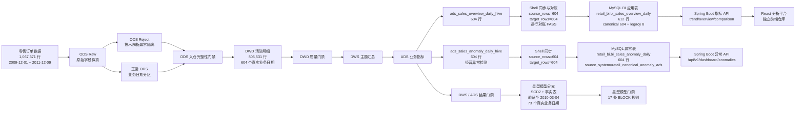

> **Scope Note**：
> - **Canonical DWD/DWS/ADS**：覆盖 604 个真实业务日期（2009-12-01 ~ 2011-12-09）
> - **Canonical Star**：连续验证至 2010-03-04，覆盖 73 个真实业务日期（不是 604 天全量历史）
> - **Serving 主线**：DWD → ads_sales_overview_daily_hive → Hive/MySQL 同步与对账 → retail_bi.bi_sales_overview_daily → Spring Boot API → React 分析平台
> - **经营异常主线**：DWD → ads_sales_anomaly_daily_hive → Hive/MySQL 同步 → retail_bi.bi_sales_anomaly_daily → Spring Boot 异常 API
> - **Star 分支**：另一条建模验证分支，不是 serving 必经路径

### 职责边界

```text
Hive ADS
  负责在数仓侧预计算日粒度经营指标

Shell 同步
  负责指定日期同步、幂等更新和 Hive / MySQL 对账

MySQL 应用表
  保存 Java 服务直接查询的轻量结果

Spring Boot
  负责参数校验、只读查询、统一响应、异常处理和 requestId

React 分析平台
  负责数据加载、统计分析、导出和时间趋势展示
```

Java 服务不扫描订单明细，也不重复执行 Hive 已完成的聚合。

---

## 3. 技术栈

### 数据仓库与调度

- MySQL 8.x
- Hive 3.x
- Hadoop / HDFS
- ORC、日期分区、Hive SQL
- Bash / Linux Shell
- DolphinScheduler 3.2.2
- Docker Standalone、SSH
- 星型模型、SCD2、数据质量门禁

### BI 应用服务

- Java 21
- Spring Boot 4.0.7
- Spring Web MVC
- Bean Validation
- MyBatis 4.0.1
- MySQL Connector/J
- Maven Wrapper
- SLF4J MDC requestId

### 前端接入

交互式分析前端位于独立仓库：

- [score-analysis-tool：通用表格数据分析平台](https://github.com/2026heita/score-analysis-tool)
- React + TypeScript + ECharts
- 支持粘贴、CSV、Excel 和可选外部数据源
- 支持描述统计、相对位置、CSV 导出和时间趋势

> 本仓库内的轻量 BI 截图属于早期静态展示；当前交互式链路由本项目 Spring Boot API 与独立前端共同完成。

---

## 4. 项目目录

```text
retail_project/
├── README.md
├── data/sample/                     # 最小公开样例数据
├── sql/                             # MySQL 清洗、DWS / ADS、日志和质量检查
├── scripts/                         # MySQL 本地执行与调度演示
├── hive_sql/                        # Hive 分层 SQL、质量门禁和 Shell 主链路
├── mysql/                           # BI 应用库建表与账号占位脚本
├── sync/                            # Hive ADS → MySQL 同步与对账
├── backend/
│   └── retail-bi-server/            # Spring Boot 指标 API
├── dolphinscheduler/                # 调度设计、导入 JSON 与辅助 SQL
└── docs/                            # 部署说明、指标口径和验收截图
```

重要入口：

| 文件 | 作用 |
|---|---|
| `hive_sql/run_all_hive.sh` | 执行 21 步完整主链路（ODS Raw/Reject/正常 ODS → ODS 入仓门禁 → DWD → DWD 门禁 → DWS/ADS → BI Overview ADS → 结果门禁 → Star Schema → Star 门禁 → 结果展示） |
| `hive_sql/run_daily_hive_profiled.sh` | 日常执行、耗时记录与阶段续跑 |
| `hive_sql/run_backfill_hive.sh` | 按日期升序回刷 |
| `hive_sql/run_idempotency_check_hive.sh` | 行数与双 CRC32 内容指纹检查 |
| `hive_sql/29_ads_sales_overview_daily_hive.sql` | 生成 BI 经营总览日指标 |
| `sync/01_sync_sales_overview_to_mysql.sh` | 单日同步并对账 |
| `backend/retail-bi-server/` | Java 指标查询服务 |

---

## 5. 数仓分层设计

### 5.1 ODS Raw：原始字段保真

表：

```text
ods_retail_raw_hive
```

设计原则：

- 业务字段先以 `STRING` 保存；
- 不在原始落地阶段静默丢弃异常值；
- 按 ETL 批次 `batch_dt` 分区；
- 使用 `INSERT OVERWRITE` 支持同批次重跑。

例如，若 `Quantity='abc'` 在入仓时直接转为整数，只会得到 `NULL`，后续无法区分“原值为空”和“格式错误”。因此类型转换和业务清洗放在下游处理。

### 5.2 ODS Reject：技术解析异常隔离

表：

```text
ods_retail_reject_hive
```

当前分流规则（6 类技术 Reject，按优先级排序）：

1. `EMPTY_INVOICE_DATE`：InvoiceDate 为空
2. `DATE_PARSE_FAILED`：InvoiceDate 无法按支持的 4 种格式解析
3. `EMPTY_QUANTITY`：quantity 为空
4. `QUANTITY_PARSE_FAILED`：quantity 无法转换为 BIGINT
5. `EMPTY_PRICE`：price 为空
6. `PRICE_PARSE_FAILED`：price 无法转换为 DECIMAL(10,2)

支持日期格式：

```text
yyyy-MM-dd HH:mm:ss
yyyy-MM-dd HH:mm
d/M/yyyy HH:mm:ss
d/M/yyyy HH:mm
```

Reject 表保留原始字段、解析结果、异常编码、异常原因和处理批次，便于追踪问题数据。

> **工程边界说明**：当前 canonical 基线 reject=0，新版 Reject 解析逻辑已支持 4 种日期格式并扩展到 6 类技术 Reject，目前完成 10 行功能样本验证，尚未使用新版逻辑对 1,067,371 行 canonical 数据执行完整重跑。

### 5.3 正常 ODS 与 DWD

正常 ODS 只接收日期可解析且属于当前 `bizdate` 的记录。

DWD 进一步过滤：

- 数量或价格无效；
- 客户、订单、商品、国家为空；
- 取消或退货订单；
- 时间无法正常解析。

DWD 时间统一为 `yyyy-MM-dd HH:mm:ss`，并计算：

```text
amount = quantity × price
```

### 5.4 DWS、ADS 与星型模型

主题层和应用层包括：

- 客户价值 DWS；
- 国家销售 DWS；
- 高价值客户销售贡献 ADS；
- 客户层级分布 ADS；
- 国家销售排行 ADS；
- 高价值客户商品偏好 ADS；
- 经营总览日 ADS。

星型模型包括：

```text
dim_user（按业务日物化完整历史快照的 SCD2）
dim_product
dim_date
dim_geo
fact_order
dws_customer_value_star_hive
```

事实表按订单日期关联用户维度的有效版本，而不是只关联当前版本。

---

## 6. 数据质量与可重跑设计

项目采用四层检查：

```text
ODS 入仓完整性
→ DWD 业务质量
→ DWS / ADS 结果质量
→ 星型模型一致性
```

### 6.1 ODS 入仓完整性

核心对账：

```text
源表行数 = ODS Raw 行数
预期正常 ODS 行数 = 正常 ODS 实际行数
预期 Reject 行数 = Reject 实际行数
```

检查失败时通过 Hive 断言阻断下游。

### 6.2 业务质量规则

| 层级 | 规则数 | 示例 |
|---|---:|---|
| DWD | 6 | 无效数量、无效价格、空客户、分区非空、行数对账、时间格式 |
| DWS / ADS | 11 | 金额对账、核心结果非空、占比汇总、贡献率范围 |
| 星型模型 | 17（当前规则定义） | SCD2 唯一性、事实表主键、行数与金额对账、维度关联；历史工程验证时为 12 条（12/12 PASS），当前 canonical 规则定义为 STAR_001~STAR_017，共 17 条 BLOCK |

处理方式：

- `BLOCK + FAIL`：返回非零退出码并阻断下游；
- `WARN + FAIL`：记录告警但不阻断；
- SQL 执行失败或结果不可读取：按门禁失败处理。

### 6.3 回刷、T+1 与幂等性

```bash
# canonical：日期区间回刷
HIVE_DATABASE=retail_canonical \
bash hive_sql/run_backfill_hive.sh 2009-12-01 2009-12-03

# canonical：重跑前一天和当天
HIVE_DATABASE=retail_canonical \
bash hive_sql/run_t1_window_hive.sh 2009-12-03

# canonical：比较重跑前后的行数和内容指纹
HIVE_DATABASE=retail_canonical \
bash hive_sql/run_idempotency_check_hive.sh 2009-12-03
```

幂等检查当前覆盖 8 张核心 ODS / DWD / DWS / ADS 表，比较：

- 行数；
- 一组 CRC32 内容指纹；
- 一组反向字符串 CRC32 内容指纹。

该指纹用于工程验收，不是密码学哈希。

---

## 7. 调度与性能实践

### 7.1 Shell 主链路

日常完整链路推荐使用：

```bash
HIVE_DATABASE=retail_canonical \
bash hive_sql/run_daily_hive_profiled.sh 2009-12-03
```

`run_daily_hive_profiled.sh` 按阶段执行：

```text
ODS
→ DWD + 质量门禁
→ DWS / ADS + 结果门禁
→ Star Schema
→ 可选结果报告
```

默认执行 Star Schema、跳过详细报告，并记录各阶段耗时；也可以从指定阶段继续执行，例如：

```bash
bash hive_sql/run_daily_hive_profiled.sh 2009-12-03 dwd
bash hive_sql/run_daily_hive_profiled.sh 2009-12-03 mart
bash hive_sql/run_daily_hive_profiled.sh 2009-12-03 star
```

`run_all_hive.sh` 是 21 步完整主链路，包含建表、门禁、BI Overview ADS、Star Schema 和最终结果展示，是首次复现的完整入口。

脚本使用：

```bash
set -Eeuo pipefail
```

任意 SQL、门禁或子脚本失败时立即停止。

### 7.2 DolphinScheduler

已完成：

- DolphinScheduler 3.2.2 Docker Standalone；
- 元数据库从 H2 迁移到 MySQL；
- 自定义镜像加入 MySQL Connector/J 和 OpenSSH Client；
- Shell 节点通过 SSH 调用 Hadoop / Hive 主机；
- 12 节点演示 DAG 成功运行。

当前导入 JSON：

```text
dolphinscheduler/retail_hive_offline_warehouse_daily_demo.json
```

JSON 使用占位参数，不包含真实服务器信息。当前 12 节点 DAG 是已验收的历史主链路调度演示；当前日常完整执行入口已演进为 `run_daily_hive_profiled.sh`，因此该 DAG 不等同于当前完整日常链路。

### 7.3 SQL 优化

已完成的优化实践：

- 识别 `United Kingdom` 国家热点 Key；
- 对国家销售聚合使用 Salt 与两阶段聚合；
- 订单数和客户数使用独立去重路径，避免加盐后重复计数；
- 大表关联小表使用 `MAPJOIN`；
- ADS Join 增加日期分区条件；
- 通过 `EXPLAIN` 验证 Map Join。

一次单机虚拟机完整日常链路耗时约：

```text
1963 秒，约 32 分 43 秒
```

主要耗时集中在星型模型和多层质量门禁。该结果只代表当时的单机环境，不是生产 SLA。

---

## 8. BI 经营总览指标

### 8.1 指标表

Hive ADS：

```text
ads_sales_overview_daily_hive
```

MySQL 应用表：

```text
retail_bi.bi_sales_overview_daily
```

两张表粒度均为“每个业务日期一行”。

| 指标 | 字段 | 口径 |
|---|---|---|
| 销售额 | `total_sales` | DWD 有效订单金额合计 |
| 订单数 | `total_orders` | 去重有效订单数 |
| 客户数 | `total_customers` | 去重有效客户数 |
| 销量 | `total_quantity` | 有效商品数量合计 |
| 客单价 | `avg_order_value` | `total_sales / total_orders`，订单数为 0 时返回 0 |

### 8.2 生成与同步

```bash
# canonical：生成指定日期的 Hive ADS
hive --database retail_canonical \
  --hiveconf start_dt=2009-12-03 \
  --hiveconf end_dt=2009-12-03 \
  -f hive_sql/29_ads_sales_overview_daily_hive.sql

# 创建 MySQL 应用表
mysql -u root -p < mysql/01_create_retail_bi_tables.sql

# canonical：同步指定日期
HIVE_DATABASE=retail_canonical \
bash sync/01_sync_sales_overview_to_mysql.sh 2009-12-03
```

同步脚本会：

1. 确认 Hive 指定日期有且只有一行；
2. 使用日期主键和 `ON DUPLICATE KEY UPDATE` 幂等写入；
3. 检查 MySQL 目标端行数；
4. 对比业务日期与五项指标；
5. 对账不一致时返回非零退出码。

`mysql/02_create_retail_bi_users.example.sql` 是可提交的账号初始化模板，只保留密码占位符。
本地使用时复制为 `mysql/02_create_retail_bi_users.local.sql`，替换为本机密码后执行；
`local.sql` 已由 `.gitignore` 排除，不应提交到公开仓库。

### 8.3 演示日期说明

`2026-04-08` 是 `engineering_legacy_3x` 历史工程回归日期。

`2026-04-01` 至 `2026-04-07` 用于验证多日期 ADS、同步、趋势 API 和前端时间序列链路。多个演示日期结果相同，不代表业务连续多天完全一致。

---

## 9. Spring Boot 指标 API

后端目录：

```text
backend/retail-bi-server/
```

### 9.1 环境变量

建议显式配置：

```text
RETAIL_DB_HOST
RETAIL_DB_PORT
RETAIL_DB_NAME
RETAIL_DB_USERNAME
RETAIL_DB_PASSWORD
SERVER_PORT
```

PowerShell 启动示例：

```powershell
cd backend\retail-bi-server

$env:RETAIL_DB_HOST = "<mysql-host>"
$env:RETAIL_DB_USERNAME = "retail_api_user"
$env:RETAIL_DB_PASSWORD = "<API 用户本地密码>"

.\mvnw.cmd clean test
.\mvnw.cmd spring-boot:run
```

### 9.2 API 列表

#### 健康检查

```http
GET /api/v1/health
```

只检查应用进程，不查询业务表。

#### 单日销售概览

```http
GET /api/v1/dashboard/overview?date=2009-12-03
```

规则：

- `date` 必填；
- 不能晚于当前日期；
- 无数据时返回 `404`。

#### 日期范围趋势

```http
GET /api/v1/dashboard/overview/trend?startDate=2009-12-01&endDate=2009-12-03
```

规则：

- `startDate`、`endDate` 必填；
- 日期格式为 `yyyy-MM-dd`；
- 不能查询未来日期；
- 开始日期不能晚于结束日期；
- 单次最多包含 31 个自然日；
- 结果按 `dt` 升序返回。

历史工程 profile 的成功响应格式示例（当前 canonical 数据返回 `sourceSystem=retail_canonical_ads`）：

```json
{
  "code": 200,
  "message": "success",
  "data": [
    {
      "dt": "2026-04-08",
      "totalSales": 53230287.48,
      "totalOrders": 36969,
      "totalCustomers": 5878,
      "totalQuantity": 32118447,
      "avgOrderValue": 1439.86,
      "sourceSystem": "hive_ads"
    }
  ],
  "requestId": "00979494-150e-4c13-a1a4-a61ee32b0f67"
}
```

参数错误示例：

```json
{
  "code": 400,
  "message": "开始日期不能为空",
  "data": null,
  "requestId": "bde1111f-bb87-4a78-bfd7-c9524f397d7e"
}
```

#### 日环比对比

```http
GET /api/v1/dashboard/overview/comparison?date=2009-12-13
```

功能：对比当前日与同一 source_system 下上一可用业务日期的经营数据，计算五项指标的环比变化百分比。

规则：

- `date` 必填，格式为 `yyyy-MM-dd`；
- 不能晚于当前日期；
- 当前日无数据时返回 `404`；
- 上一可用业务日不存在时返回 `200`，`comparisonAvailable=false`，`comparisonDate`、`previous` 和 `changePercent` 为 `null`；
- 环比公式：`(current - previous) / previous × 100`，使用 `BigDecimal` 计算，保留两位小数；
- 上一可用业务日某项指标为 0 时，对应百分比返回 `null`，避免除以 0。

业务接口使用统一 `ApiResponse`。`RequestIdFilter` 会读取或生成 `X-Request-Id`，写入响应头和 MDC；业务响应体同时返回 `requestId`，便于关联前后端日志。

### 9.3 CORS 边界

当前后端对 `/api/**` 明确允许以下来源：

```text
http://localhost:*
http://127.0.0.1:*
https://datainsightkit.com
https://2026heita.github.io
```

仅允许 `GET` / `OPTIONS`，暴露 `X-Request-Id` 响应头，不使用无限制 `*` 来源放行。

---

## 10. 经营异常检测

### 10.1 Hive ADS 经营异常表

**表名**：`ads_sales_anomaly_daily_hive`

**数据库**：`retail_canonical`

**粒度**：每个真实业务日期一行。

**核心字段**：

| 字段 | 含义 |
|---|---|
| dt | 业务日期 |
| total_sales | 当日销售额 |
| total_orders | 当日订单数 |
| total_customers | 当日客户数 |
| total_quantity | 当日销量 |
| avg_order_value | 客单价 |
| prev_dt | 上一可用业务日 |
| prev_sales | 上一可用业务日销售额 |
| sales_change_pct | 销售额变化百分比 |
| sales_loss_amount | 销售损失金额 |
| orders_change_pct | 订单数变化百分比 |
| customers_change_pct | 客户数变化百分比 |
| quantity_change_pct | 销量变化百分比 |
| aov_change_pct | 客单价变化百分比 |
| anomaly_level | 异常等级 |
| primary_driver | 主要驱动指标 |

**异常等级（V1 已冻结）**：

| 等级 | 规则 |
|---|---|
| NOT_EVALUATED | 不存在上一可用业务日 |
| HIGH | sales_change_pct <= -50 AND sales_loss_amount >= 30000 AND (orders/customers/quantity/aov 至少一个变化 <= -40) |
| MEDIUM | sales_change_pct <= -40 AND sales_loss_amount >= 20000 |
| NORMAL | 其余情况 |

**分布结果（canonical，604 个真实业务日期，2009-12-01 ~ 2011-12-09）**：

| anomaly_level | count |
|---|---|
| HIGH | 21 |
| MEDIUM | 24 |
| NORMAL | 558 |
| NOT_EVALUATED | 1 |

**比较口径说明**：这里比较的是"上一可用业务日"，不是自然日 yesterday。例如 2009-12-13 的上一可用业务日为 2009-12-11，因为 2009-12-12 没有业务数据。

### 10.2 异常指标解释

**销售额核心拆解**：

```
sales = orders × avg_order_value
```

因此：
- **直接驱动指标**：ORDERS、AVG_ORDER_VALUE
- **辅助经营信号**：CUSTOMERS、QUANTITY

`primary_driver` 最终只在 ORDERS 和 AVG_ORDER_VALUE 之间选择。不要把 CUSTOMERS / QUANTITY 写成销售额恒等式中的直接驱动。

**边界说明**：经营异常检测和指标分解不等于因果推断。当前实现是规则式经营异常检测 + 指标分解，不是根因分析系统、不是 AI 异常检测、不是机器学习模型。

### 10.3 Hive → MySQL Serving

**MySQL Serving 表**：`retail_bi.bi_sales_anomaly_daily`

**数据来源**：`retail_canonical.ads_sales_anomaly_daily_hive`

**source_system**：`retail_canonical_anomaly_ads`

**批量同步脚本**：`sync/04_backfill_sales_anomaly_to_mysql_v2.sh`

**实现方式**：Hive 输出原始 16 列 TSV → Python `csv.reader(delimiter="\t")` 解析 → 生成 MySQL UPSERT → 写入目标表。

**单日同步脚本**：`sync/03_sync_sales_anomaly_to_mysql.sh`（已完成真实验证）

604 个业务日期已完成批量同步。

### 10.4 Spring Boot 异常 API

**接口**：

```http
GET /api/v1/dashboard/anomalies?startDate=yyyy-MM-dd&endDate=yyyy-MM-dd
```

**规则**：
- 直接查询 `bi_sales_anomaly_daily`
- 只返回 MEDIUM / HIGH 等级异常
- 无异常时返回 HTTP 200 + `[]`，不是 404
- Spring Boot 层不重新计算 Hive 已确定的异常规则

**CORS**：已允许 `https://datainsightkit.com` 和 `https://2026heita.github.io`

---

## 11. 已验证结果

### 11.1 `engineering_legacy_3x` 历史工程回归日期：`2026-04-08`

```text
源表 retail                 3,202,113
ODS Raw                     3,202,113
source_raw_diff                     0

预期正常 ODS               3,202,113
正常 ODS                   3,202,113
expected_ods_diff                   0

预期 Reject                        0
实际 Reject                        0
expected_reject_diff                0

DWD 行数                  2,416,593
fact_order 行数           2,416,593
DWD / fact_order 金额     53,230,287.48
客户数                        5,878
商品数                        4,630
国家数                           41
高价值客户销售贡献率          86.68%
```

质量结果：

```text
MySQL 数据质量门禁       20 / 20 PASS
星型模型质量门禁         12 / 12 PASS（历史工程验证，当时为12条规则）
MySQL 当前批次日志       START=1 / SUCCESS=1 / FAILED=0
```

### 11.2 Canonical 真实 SCD2 验证

**验证范围**：Star 历史已连续回刷并验证至 2010-03-04，覆盖 73 个真实业务日期；其中在 2010-03-04 对 customerid=12431 的 Belgium → Australia 真实属性变化进行了重点 SCD2 验证。完整 DWD 保留 604 个真实业务日期。

**SCD2 版本变化（customerid=12431）**：
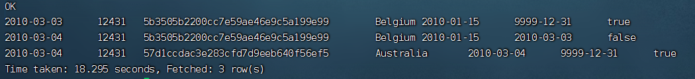
> 证明：Belgium 旧版本（user_id=5b3505b2200cc7e59ae46e9c5a199e99）关闭至 2010-03-03，is_current=false；Australia 新版本（user_id=57d1ccdac3e283cfd7d9eeb640f56ef5）从 2010-03-04 生效，is_current=true。

**事实表关联 SCD2 新验证（customerid=12431，2010-03-04）**：
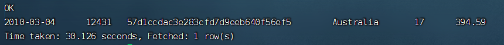
> 证明：2010-03-04 fact_order 正确关联 Australia 新 user_id=57d1ccdac3e283cfd7d9eeb640f56ef5，fact_rows=17，fact_amount=394.59。

### 11.3 历史多日验证

`docs/multiday_validation_screenshots/` 保存了较早数据版本的多日分区、区间回刷、幂等性和 T+1 验证截图。

历史基线中的 DWD 行数和国家数与当前完整回归不同，因此两组数据只用于证明不同阶段的工程能力，不能直接横向比较业务结果。

### 11.4 BI 应用链路

**历史工程验证（engineering_legacy_3x）**：

```text
Hive ads_sales_overview_daily_hive
→ Shell 同步
→ MySQL bi_sales_overview_daily
→ Spring Boot trend API
→ React 时间趋势
```

趋势接口已返回 `2026-04-01` 至 `2026-04-08` 共 8 行数据，并保留 `sourceSystem=hive_ads`。

**Canonical 真实数据验证**：

Hive ADS 已完成全范围验证（604 个真实业务日期，2009-12-01 ~ 2011-12-09）：

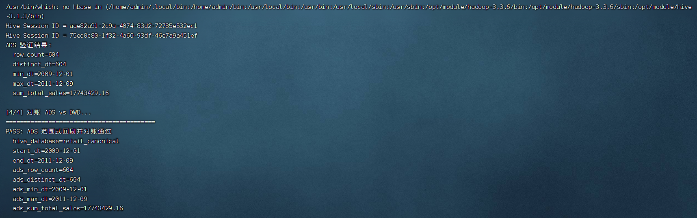
> 验证结果：row_count=604，distinct_dt=604，min_dt=2009-12-01，max_dt=2011-12-09，total_sales=17,743,429.16。

Hive → MySQL 同步已完成全范围验证：

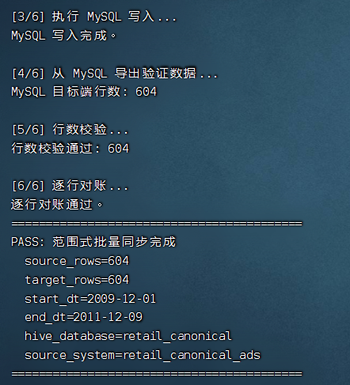
> 验证结果：source_rows=604，target_rows=604，日期范围 2009-12-01 ~ 2011-12-09，total_sales=17,743,429.16，逐行对账 PASS。
> MySQL 中保留两组数据：旧历史展示数据（source_system=hive_ads，8 行，2026-04-01 ~ 2026-04-08）和 canonical 数据（source_system=retail_canonical_ads，604 行）。

Spring Boot API 已真实连接 canonical serving 数据：

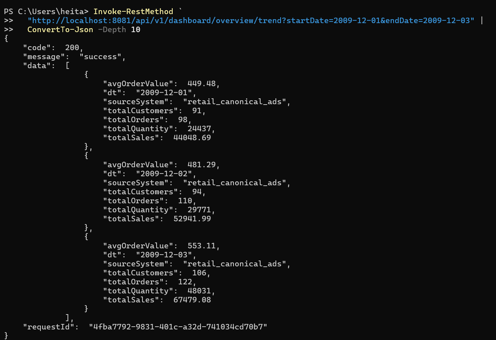
> 趋势接口真实验证 2009-12-01 ~ 2009-12-03，返回数据与 Hive ADS / MySQL 完全一致，sourceSystem=retail_canonical_ads。

Spring Boot 环比业务语义已修正并真实验证：

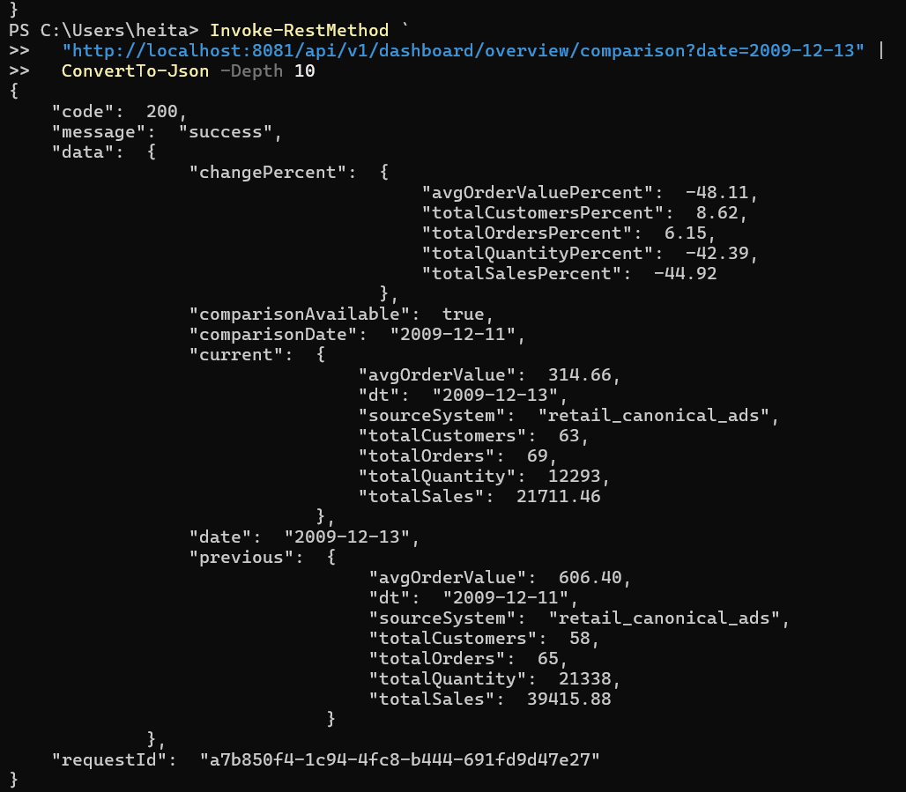
> 真实验证：2009-12-13 → 2009-12-11（跳过无数据的 2009-12-12），comparisonAvailable=true，两边 sourceSystem 均为 retail_canonical_ads。
> 连续日期回归：2009-12-03 → 2009-12-02 仍然 PASS。
> Spring Boot 自动化测试：当前单元测试与集成测试全部通过，其中包含基于 Testcontainers + MySQL 8、复用真实 MySQL DDL 的 SalesOverviewMapper / SalesAnomalyMapper 集成测试，覆盖单日查询、日期范围查询、上一可用业务日查询，以及异常等级过滤、source_system 隔离、日期排序和结果映射；Backend CI 执行 ./mvnw -B clean verify。

前端 canonical 日环比验证：

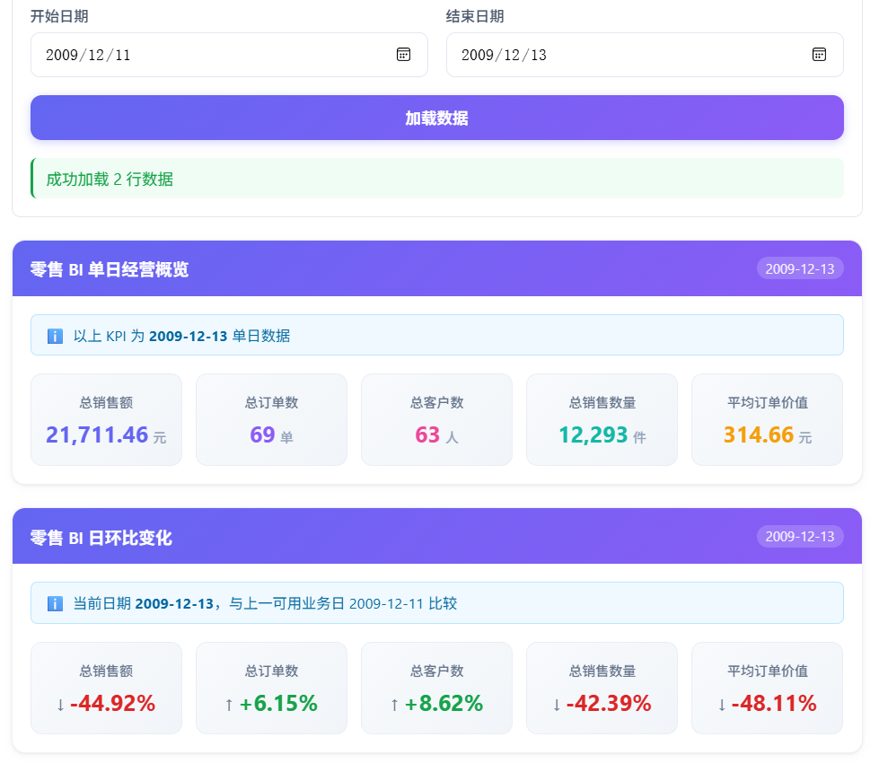
> 前端展示 2009-12-13 与上一可用业务日 2009-12-11 的经营指标比较，跳过无数据的 2009-12-12。对应 API 验证结果中 comparisonAvailable=true、sourceSystem=retail_canonical_ads。

### 11.5 经营异常检测链路验证

Hive 经营异常 ADS 已完成全范围验证（604 个真实业务日期，2009-12-01 ~ 2011-12-09）：

```text
anomaly_level 分布：
- HIGH: 21
- MEDIUM: 24
- NORMAL: 558
- NOT_EVALUATED: 1
```

真实验证案例（2010-09-28）：

```text
dt: 2010-09-28
prev_dt: 2010-09-27
total_sales: 40,204.85
prev_sales: 115,243.44
sales_change_pct: -65.11
sales_loss_amount: 75,038.59
orders_change_pct: +21.11
customers_change_pct: +31.88
quantity_change_pct: -82.14
aov_change_pct: -71.19
anomaly_level: HIGH
primary_driver: AVG_ORDER_VALUE
```

业务解释：与上一可用业务日相比，销售额下降 65.11%，对应销售损失 75,038.59。订单数上涨 21.11%，平均客单价下降 71.19%，因此 AVG_ORDER_VALUE 是主要直接驱动指标。客户数上涨 31.88%，销售数量下降 82.14%，作为辅助经营信号。

Hive 异常检测结果：


> 证明：2010-09-28 为 HIGH 等级异常，sales_change_pct=-65.11%，primary_driver=AVG_ORDER_VALUE。

Spring Boot 异常 API 真实验证：

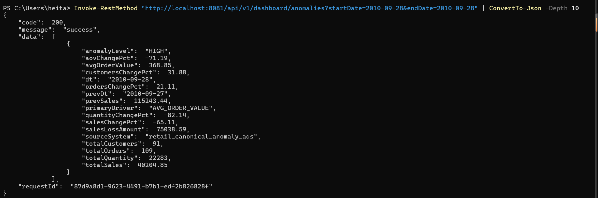
> 证明：查询 2010-09-28 返回 HIGH 等级异常，sourceSystem=retail_canonical_anomaly_ads，数据与 Hive 一致。

---

## 12. 运行截图

目录：

```text
docs/result_screenshots/
```

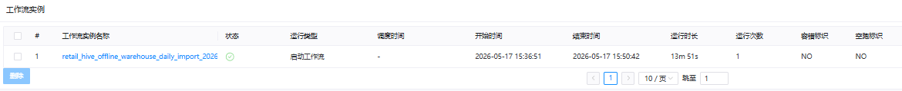

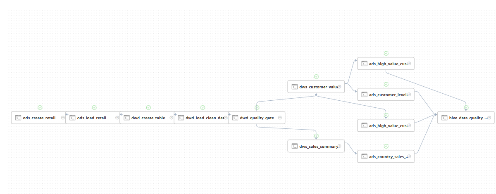

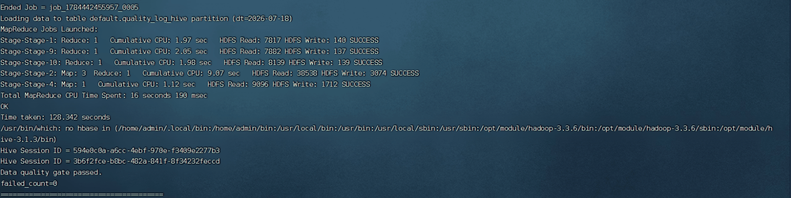

更多截图：

```text
04_ads_sales_contribution_20260408.png
05_ads_customer_level_distribution_20260408.png
06_ads_country_sales_rank_20260408.png
07_ads_customer_preference_20260408.png
08_light_bi_dashboard_top_20260408.png
09_light_bi_dashboard_bottom_20260408.png
```

历史多日验收截图：

```text
docs/multiday_validation_screenshots/
├── 01_7day_ods_partition_check.png
├── 02_7day_dwd_partition_check.png
├── 03_7day_ads_country_rank_check.png
├── 04_idempotency_check_20260403.png
├── 05_t1_window_check_20260406_20260407.png
└── 06_dwd_cleaning_quality_20260401.png
```

---

## 13. 本地最小复现

> 本节使用仓库内 `data/sample/retail_sample.csv` 做最小环境复现，因此示例业务日期沿用样例文件中的 `2026-04-08`。该日期属于本地功能样例，不代表当前 canonical 真实业务数据口径；canonical 主线使用 2009—2011 年真实业务日期。

详细说明：

- [本地 Hive 部署与运行](docs/setup_local_hive.md)
- [Hive 迁移与工程设计](hive_sql/hive_migration_design.md)
- [DolphinScheduler 工作流设计](dolphinscheduler/workflow_design.md)

### 13.1 创建样例源表

> `00_bootstrap_sample_source_hive.sql` 会删除并重建 `retail`，只应在独立测试环境执行。

```bash
hive \
  --hiveconf source_file=/path/to/retail_project/data/sample/retail_sample.csv \
  -f hive_sql/00_bootstrap_sample_source_hive.sql
```

### 13.2 执行 Hive 主链路

```bash
bash hive_sql/run_all_hive.sh 2026-04-08
```

### 13.3 创建并同步 BI 应用表

```bash
# 1. 创建 BI 数据库与 Serving 表
mysql -u root -p < mysql/01_create_retail_bi_tables.sql
mysql -u root -p < mysql/03_create_retail_bi_anomaly_table.sql

# 2. 从公开模板创建本地账号配置
cp mysql/02_create_retail_bi_users.example.sql \
   mysql/02_create_retail_bi_users.local.sql

# 3. 在 local.sql 中替换 __SYNC_PASSWORD__ 和 __API_PASSWORD__
#    然后创建最小权限数据库账号
mysql -u root -p < mysql/02_create_retail_bi_users.local.sql

# 4. 同步本地样例 ADS
HIVE_DATABASE=default \
SOURCE_SYSTEM=local_sample_ads \
bash sync/01_sync_sales_overview_to_mysql.sh 2026-04-08
```

本地最小复现使用 `default` Hive 数据库，并将 Serving 数据显式标记为
`source_system=local_sample_ads`。该标识仅表示仓库内公开样例数据，
不代表 `canonical` 数据；canonical Serving 使用 `retail_canonical_ads`。

### 13.4 启动 Java 服务

```powershell
cd backend\retail-bi-server

$env:RETAIL_DB_USERNAME = "retail_api_user"
$env:RETAIL_DB_PASSWORD = "<与 mysql/02_create_retail_bi_users.local.sql 中 __API_PASSWORD__ 对应的本地密码>"

.\mvnw.cmd spring-boot:run
```

Java 服务使用只读账号 `retail_api_user`；`RETAIL_DB_PASSWORD` 必须与本地账号配置中的 API 用户密码一致，不要使用 `retail_sync_user` 的同步密码。

验证：

```text
GET http://localhost:8080/api/v1/health
GET http://localhost:8080/api/v1/dashboard/overview?date=2026-04-08
GET http://localhost:8080/api/v1/dashboard/overview/trend?startDate=2026-04-08&endDate=2026-04-08
```

---

## 14. 核心设计取舍

### 为什么 Java 不查询明细并现场聚合？

经营指标已经在 Hive ADS 中按天预计算。Java 读取 MySQL 应用表，可以避免重复口径、减少查询压力，也更符合“数仓负责指标计算，应用服务负责查询交付”的职责分工。

### 为什么 SQL 没有全部迁移到 MyBatis XML？

当前只有单日查询和简单日期范围查询，注解 SQL 可读性足够。只有在出现动态维度、复杂条件、排序或分页后，才有必要迁移到 XML，避免为了形式提前增加复杂度。

### 为什么先做质量门禁，再追求极致性能？

当前是单机离线工程实践，优先目标是结果正确、失败可见、任务可重跑。已经通过耗时分析和 SQL 优化定位瓶颈，但没有为了缩短少量时间牺牲可维护性。

### 为什么多日趋势数据要明确标注为演示数据？

`2026-04-01` 至 `2026-04-07` 用于验证链路，不代表业务连续七天的自然波动。公开项目应区分技术验证数据和业务结论。

---

## 15. 当前边界

本项目当前不包含：

- CDC 或实时流处理；
- MySQL 到 Hive 的自动同步任务；
- 任意维度的动态聚合查询；
- 订单明细钻取与分页接口；
- 登录权限、缓存、OpenAPI 和 Docker 化后端；
- 已使用 GitHub Actions 覆盖后端 Maven `clean verify` 与数仓 Shell `bash -n` / ShellCheck，但尚未实现自动部署、环境晋级、制品发布、回滚等 CD / 生产级发布流水线；
- 公网可直接访问的后端服务；
- 完整生产级监控和高可用部署。

其他边界：

- DolphinScheduler JSON 仍保留为已验收的 12 节点历史主链路演示，尚未按当前 `run_daily_hive_profiled.sh` 的阶段化日常完整链路重新编排；
- 当前 canonical 已验收基线 reject=0；新版 Reject 解析逻辑已支持 4 种日期格式并扩展到 6 类技术 Reject，目前完成 10 行功能样本验证，尚未使用新版逻辑对 1,067,371 行 canonical 数据执行完整重跑；
- SCD2 历史回刷保护仍是独立脚本；
- Star 历史已连续回刷并验证至 2010-03-04，覆盖 73 个真实业务日期；其中在 2010-03-04 对 customerid=12431 的 Belgium → Australia 真实属性变化进行了重点 SCD2 验证。完整 DWD 保留 604 个真实业务日期；
- 幂等性指纹当前只覆盖 8 张核心表；
- 历史截图和当前完整回归不是同一数据基线。

这些边界不会影响项目作为离线数仓与 BI 工程能力展示，但在简历和面试中需要如实说明。

---

## 16. React BI 展示效果

React BI 前端项目已实现零售 BI 数据连接器，完整闭环：

```
Hive ADS → Shell 同步 → MySQL → Spring Boot API → React 前端展示
```

#### 1. BI Connector 接入成功

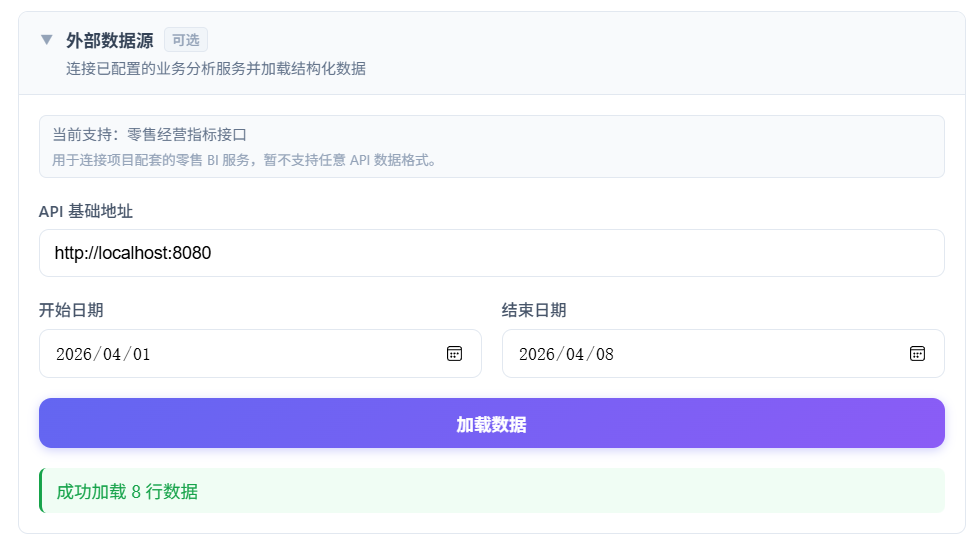

> React BI 前端项目配置 API 地址和日期范围后，成功加载零售经营指标数据。

#### 2. 单日经营概览与日环比


> 展示总销售额、总订单数、总客户数、总销售数量和平均订单价值，并计算同一 source_system 下上一可用业务日环比。

#### 3. 多日销售趋势

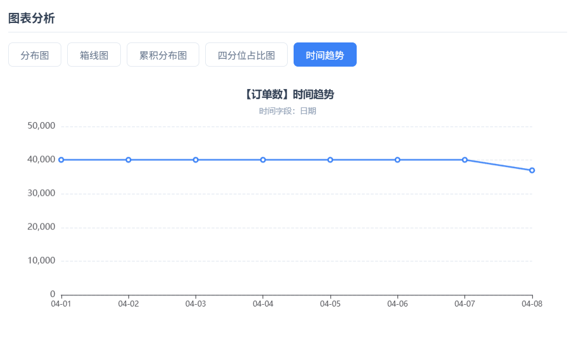

> 复用前端通用时间趋势分析能力，截图以总销售额指标为例。

---

## 17. 延伸文档

| 文档 | 内容 |
|---|---|
| [docs/warehouse_implementation_details.md](docs/warehouse_implementation_details.md) | 数仓分层、质量门禁、回刷、SCD2、调度、性能分析及 BI 应用闭环 |
| [backend/retail-bi-server/README.md](backend/retail-bi-server/README.md) | Spring Boot 后端配置、接口、环境变量、运行方式与当前边界 |
| [docs/setup_local_hive.md](docs/setup_local_hive.md) | 本地 Hive 最小部署与复现 |
| [hive_sql/hive_migration_design.md](hive_sql/hive_migration_design.md) | Hive 分层、质量、回刷、SCD2 和性能设计 |
| [hive_sql/interview_hive_talking_points.md](hive_sql/interview_hive_talking_points.md) | 技术问题与设计依据 |
| [docs/27_metric_definitions.txt](docs/27_metric_definitions.txt) | 指标口径 |
| [dolphinscheduler/deployment_mysql_ssh.md](dolphinscheduler/deployment_mysql_ssh.md) | 调度环境部署 |
| [dolphinscheduler/workflow_design.md](dolphinscheduler/workflow_design.md) | DAG 设计与边界 |
| [docs/result_screenshots/README.md](docs/result_screenshots/README.md) | 当前回归截图说明 |
| [docs/multiday_validation_screenshots/README.md](docs/multiday_validation_screenshots/README.md) | 历史多日验证基线说明 |

---

## 18. 公开仓库说明

仓库只应保留：

- 示例数据；
- 密码占位符；
- DolphinScheduler 占位参数；
- 已脱敏截图；
- 可复现脚本和文档。

不要提交：

- 明文数据库密码；
- `.env` 或本地连接配置；
- MySQL login-path 文件；
- 全量原始数据；
- 运行日志、构建产物和临时文件；
- 未脱敏的服务器信息或截图。

提交前建议执行：

```bash
git status --short
git diff --check
git diff --cached --name-status
```

确认没有密码、日志、压缩包、构建目录或误放文件后再推送。