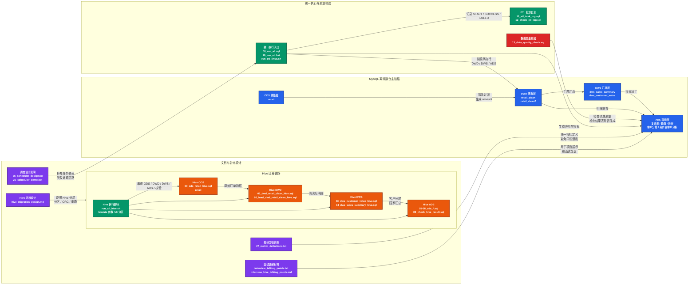

# 零售数据分析离线数仓项目：MySQL 到 Hive 迁移实践

## 1. 项目简介

本项目基于电商零售订单数据，围绕订单、客户、商品、国家等维度进行离线数仓建模与业务指标分析。

项目第一阶段使用 MySQL 完成 ODS、DWD、DWS、ADS 四层离线数仓链路，覆盖原始数据清洗、主题汇总、应用层指标输出、统一执行脚本、ETL 批次日志记录和数据质量校验等内容。

项目第二阶段在 MySQL 版本基础上完成 Hive 迁移，将核心指标链路改造为 ODS、DWD、DWS、ADS 分层结构。Hive 版本统一使用 `dt` 分区、ORC 列式存储和 `INSERT OVERWRITE PARTITION` 分区覆盖写入方式，并通过 `bizdate` 参数支持指定业务日期重跑。

本项目重点不是单纯编写查询 SQL，而是完整展示从原始订单数据清洗、客户价值分层、业务指标沉淀，到 Hive 离线数仓迁移和工程化执行的实践过程。

## 2. 项目架构图



## 3. 技术栈

- MySQL
- Hive
- SQL
- Linux Shell / WSL
- Windows BAT 批处理脚本
- HDFS
- ORC
- 离线数仓分层建模
- 数据质量校验
- ETL 批次日志记录
- Navicat

## 4. 项目目录结构

```text
retail_project/
├── README.md
│
├── sql/
│   ├── 01_clean.sql
│   ├── 02_basic_analysis.sql
│   ├── 03_window_analysis.sql
│   ├── 04_advanced_analysis.sql
│   ├── 05_dws_layer.sql
│   ├── 06_ads_layer.sql
│   ├── 08_run_all.sql
│   ├── 11_etl_task_log.sql
│   ├── 12_check_etl_log.sql
│   ├── 13_data_quality_check.sql
│   ├── 14_ads_customer_revenue_concentration.sql
│   ├── 15_ads_country_value_analysis.sql
│   ├── 16_ads_customer_level_distribution.sql
│   ├── 17_ads_product_sales_concentration.sql
│   ├── 18_ads_customer_order_frequency.sql
│   ├── 19_ads_high_value_customer_preference.sql
│   ├── 20_ads_high_value_customer_order_frequency.sql
│   ├── 21_ads_high_value_customer_country_distribution.sql
│   └── 22_ads_high_value_customer_sales_contribution.sql
│
├── hive_sql/
│   ├── 00_ods_retail_hive.sql
│   ├── 01_dwd_retail_clean_hive.sql
│   ├── 02_load_dwd_retail_clean_hive.sql
│   ├── 03_dws_customer_value_hive.sql
│   ├── 04_dws_sales_summary_hive.sql
│   ├── 05_ads_high_value_customer_sales_contribution_hive.sql
│   ├── 06_ads_customer_level_distribution_hive.sql
│   ├── 07_ads_country_sales_rank_hive.sql
│   ├── 08_ads_high_value_customer_preference_hive.sql
│   ├── 09_check_hive_result.sql
│   ├── hive_migration_design.md
│   ├── interview_hive_talking_points.md
│   ├── README.md
│   └── run_all_hive.sh
│
├── scripts/
│   ├── run_etl_linux.sh
│   ├── 10_run_etl.bat
│   └── 26_scheduler_demo.bat
│
└── docs/
    ├── 25_scheduler_design.txt
    ├── 27_metric_definitions.txt
    └── interview_talking_points.txt
```

## 5. 数据说明

本项目默认使用一张原始订单表 `retail` 作为 ODS 层数据源。

由于原始数据文件较大，仓库中不直接上传完整数据集。运行项目前，需要提前准备好同字段结构的原始订单数据表。

原始表主要字段如下：

```text
Invoice
StockCode
Description
Quantity
InvoiceDate
Price
CustomerID
Country
```

项目中的销售金额字段 `amount` 由 `Quantity * Price` 计算得到，用于后续销售额统计、客户价值分层、收入集中度分析和高价值客户贡献分析。

所有指标默认基于清洗后的有效订单数据统计，不包含异常数量、异常价格、空客户和退货订单等无效记录。

## 6. MySQL 数仓分层设计

MySQL 版本采用 ODS、DWD、DWS、ADS 四层结构。

```text
ODS 原始订单数据
        ↓
DWD 明细清洗层
        ↓
DWS 主题汇总层
        ↓
ADS 应用指标层
        ↓
数据质量校验
```

### 6.1 ODS 层

ODS 层用于存放原始零售订单数据表 `retail`，保留原始订单明细字段，作为后续清洗和建模的数据来源。

### 6.2 DWD 层

DWD 层用于对原始订单数据进行清洗，生成标准化明细表。

核心表：

```text
retail_clean
retail_clean2
```

主要清洗规则包括：

```text
Quantity > 0
Price > 0
CustomerID IS NOT NULL
Invoice NOT LIKE 'C%'
amount = Quantity * Price
```

DWD 层保留订单商品明细粒度，不改变业务粒度，只做字段标准化、异常数据过滤和金额字段补充。

### 6.3 DWS 层

DWS 层用于沉淀可复用的主题汇总结果。

核心表：

```text
dws_sales_summary
dws_customer_value
```

其中：

- `dws_sales_summary`：按国家统计订单数、客户数、销售额和客单价；
- `dws_customer_value`：按客户统计订单数、累计消费金额，并划分客户价值层级。

客户价值分层规则：

```text
High Value：total_spent >= 5000
Medium Value：1000 <= total_spent < 5000
Low Value：total_spent < 1000
```

客户价值分层沉淀在 DWS 层，后续多个 ADS 指标复用该结果，避免重复计算和指标口径不一致。

### 6.4 ADS 层

ADS 层面向具体业务分析场景输出最终结果表。

基础指标包括：

- 复购率分析；
- 月度销售趋势分析；
- 月度销售增长分析；
- 国家销售排行；
- 高价值客户名单；
- Top10 热销商品。

增强指标包括：

- 客户收入集中度分析；
- 国家价值分析；
- 客户分层分布分析；
- 商品销售集中度分析；
- 客户下单频次分布分析；
- 高价值客户偏好商品分析；
- 高价值客户下单频次分布分析；
- 高价值客户国家分布分析；
- 高价值客户销售贡献分析。

## 7. Hive 迁移设计

在 MySQL 版本完成后，项目进一步完成 Hive 迁移，形成 ODS、DWD、DWS、ADS 分层 Hive 离线数仓链路。

```text
ODS 原始订单表
        ↓
DWD 明细清洗层
        ↓
DWS 主题汇总层
        ↓
ADS 应用指标层
        ↓
Hive 结果校验
```

### 7.1 Hive ODS 层

Hive ODS 层核心表为：

```text
retail
```

该表用于保存原始零售订单数据，字段结构与 MySQL 原始表保持一致。

对应脚本：

```text
hive_sql/00_ods_retail_hive.sql
```

说明：

- `00_ods_retail_hive.sql` 主要用于创建 Hive 原始订单表；
- 如果 Hive 中已经提前准备好 `retail` 表，可以重复执行该脚本，不会覆盖已有表结构；
- 原始数据文件较大时，可以先在本地或其他工具中完成数据准备，再导入 Hive 表。

### 7.2 Hive DWD 层

Hive DWD 层核心表为：

```text
dwd_retail_clean_hive
```

该表用于保存清洗后的订单明细数据，主要完成以下处理：

- 保留订单明细粒度数据；
- 过滤无效数量、无效价格、空客户 ID 和退货订单；
- 构造销售金额字段 `amount`；
- 使用 `dt` 字段进行业务日期分区；
- 使用 ORC 列式存储。

对应脚本：

```text
hive_sql/01_dwd_retail_clean_hive.sql
hive_sql/02_load_dwd_retail_clean_hive.sql
```

### 7.3 Hive DWS 层

Hive DWS 层沉淀两个可复用主题汇总结果：

```text
dws_customer_value_hive
dws_sales_summary_hive
```

其中：

- `dws_customer_value_hive`：按客户聚合订单数、累计消费金额和客户价值层级；
- `dws_sales_summary_hive`：按国家聚合订单数、客户数、销售额和客单价。

对应脚本：

```text
hive_sql/03_dws_customer_value_hive.sql
hive_sql/04_dws_sales_summary_hive.sql
```

### 7.4 Hive ADS 层

Hive ADS 层产出面向业务问题的最终指标表：

```text
ads_high_value_customer_sales_contribution_hive
ads_customer_level_distribution_hive
ads_country_sales_rank_hive
ads_high_value_customer_preference_hive
```

对应脚本：

```text
hive_sql/05_ads_high_value_customer_sales_contribution_hive.sql
hive_sql/06_ads_customer_level_distribution_hive.sql
hive_sql/07_ads_country_sales_rank_hive.sql
hive_sql/08_ads_high_value_customer_preference_hive.sql
```

### 7.5 Hive 分区设计

Hive 版本 DWD、DWS、ADS 各层核心结果表统一使用 `dt` 作为分区字段：

```sql
PARTITIONED BY (dt STRING)
```

`dt` 表示业务日期，执行任务时通过 `bizdate` 参数传入。

示例：

```bash
sh run_all_hive.sh 2026-04-08
```

SQL 文件中统一使用：

```sql
'${hiveconf:bizdate}'
```

这样可以支持指定日期分区重跑，避免每次处理全量历史数据。

### 7.6 Hive 存储格式

Hive 版本各层结果表统一使用 ORC 列式存储：

```sql
STORED AS ORC
```

本项目主要是离线聚合分析，例如按客户、国家、商品统计订单数、客户数、销售额和销售贡献。ORC 列式存储更适合这类分析查询场景，也便于和 Hive 分区表结合使用。

### 7.7 Hive 写入方式

Hive 版本统一使用：

```sql
INSERT OVERWRITE TABLE table_name
PARTITION (dt = '${hiveconf:bizdate}')
```

使用 `INSERT OVERWRITE PARTITION` 的原因是：

- 支持指定日期分区重跑；
- 避免重复执行导致重复数据；
- 保证离线任务具备幂等性；
- 方便任务失败或口径调整后重新覆盖对应业务日期分区。

### 7.8 Hive 执行脚本

Hive 版本通过 `run_all_hive.sh` 串联完整执行链路：

```text
00_ods_retail_hive.sql
        ↓
01_dwd_retail_clean_hive.sql
        ↓
02_load_dwd_retail_clean_hive.sql
        ↓
03_dws_customer_value_hive.sql
        ↓
04_dws_sales_summary_hive.sql
        ↓
05_ads_high_value_customer_sales_contribution_hive.sql
        ↓
06_ads_customer_level_distribution_hive.sql
        ↓
07_ads_country_sales_rank_hive.sql
        ↓
08_ads_high_value_customer_preference_hive.sql
        ↓
09_check_hive_result.sql
```

脚本每一步执行后都会检查返回状态，如果某一步失败，会立即停止后续任务，避免错误数据继续向下游扩散。

## 8. 核心分析指标

### 8.1 客户收入集中度分析

通过统计 Top10 和 Top50 客户销售贡献占比，判断平台收入是否过度依赖少数头部客户。

对应脚本：

```text
sql/14_ads_customer_revenue_concentration.sql
```

### 8.2 国家价值分析

在国家销售排行基础上，进一步统计各国家的订单数、客户数、销售额、客单价、人均消费和每客订单数，用于分析不同国家市场的规模和客户质量。

对应脚本：

```text
sql/15_ads_country_value_analysis.sql
```

### 8.3 客户分层分布分析

基于客户累计消费金额，将客户划分为 High Value、Medium Value、Low Value，并统计各层级客户人数占比和销售贡献占比。

对应脚本：

```text
sql/16_ads_customer_level_distribution.sql
```

### 8.4 商品销售集中度分析

通过 Top10 和 Top50 商品销售贡献占比，判断销售额是否集中在少数爆款商品上。

对应脚本：

```text
sql/17_ads_product_sales_concentration.sql
```

### 8.5 客户下单频次分布分析

按照客户下单次数进行分档统计，用于观察客户购买活跃度和复购深度。

对应脚本：

```text
sql/18_ads_customer_order_frequency.sql
```

### 8.6 高价值客户偏好商品分析

仅在 High Value 客户群体内统计商品购买情况，包括客户覆盖人数、订单数、销量和销售额，用于识别核心客户更偏好的商品。

对应脚本：

```text
sql/19_ads_high_value_customer_preference.sql
```

### 8.7 高价值客户下单频次分布分析

对高价值客户按下单次数进行分档统计，用于判断高价值客户主要是一次性高消费客户，还是持续复购型客户。

对应脚本：

```text
sql/20_ads_high_value_customer_order_frequency.sql
```

### 8.8 高价值客户国家分布分析

统计不同国家的高价值客户人数、订单数、销售额、人均价值和订单密度，用于识别高价值客户更集中的重点市场。

对应脚本：

```text
sql/21_ads_high_value_customer_country_distribution.sql
```

### 8.9 高价值客户销售贡献分析

统计高价值客户人数、订单数、销售额、平台总销售额、销售贡献占比、人均销售额和人均订单数，用于衡量核心客户群体对整体销售额的贡献程度。

对应脚本：

```text
sql/22_ads_high_value_customer_sales_contribution.sql
hive_sql/05_ads_high_value_customer_sales_contribution_hive.sql
```

## 9. 执行方式

### 9.1 MySQL 版本执行方式

#### Windows + Navicat 执行

1. 创建并进入 MySQL 数据库 `retail_project`；
2. 导入原始订单数据表 `retail`；
3. 执行 `sql/11_etl_task_log.sql`，创建 ETL 日志表；
4. 执行 `sql/08_run_all.sql`，完成 DWD、DWS、ADS 全流程建表和指标生成；
5. 执行 `sql/13_data_quality_check.sql`，检查核心结果表和清洗质量。

#### WSL / Linux Shell 执行

进入项目目录后执行：

```bash
bash scripts/run_etl_linux.sh
```

脚本会调用统一 SQL 执行入口，并记录 ETL 执行日志。

### 9.2 Hive 版本执行方式

进入 Hive SQL 目录：

```bash
cd hive_sql
```

执行完整 Hive 迁移链路：

```bash
sh run_all_hive.sh 2026-04-08
```

其中，`2026-04-08` 为业务日期参数，可根据实际数据日期调整。

Hive 脚本会按顺序执行 ODS、DWD、DWS、ADS 和结果校验脚本。如果某一步执行失败，脚本会停止后续任务。

## 10. 数据质量校验

### 10.1 MySQL 数据质量校验

MySQL 版本提供 `sql/13_data_quality_check.sql` 用于核心结果校验，主要检查：

- DWD 层是否仍存在异常数量；
- DWD 层是否仍存在异常价格；
- DWD 层是否仍存在空客户；
- DWD 层是否仍存在退货订单；
- DWS 客户分层是否为空；
- ADS 关键结果表是否成功生成；
- 高价值客户相关指标表是否为空。

### 10.2 Hive 数据质量校验

Hive 版本提供 `hive_sql/09_check_hive_result.sql` 用于检查 Hive 迁移结果，主要包括：

- DWD、DWS、ADS 各层核心表在指定 `dt` 分区下是否有数据；
- DWD 清洗后是否仍存在无效数量、无效价格、空客户、退货订单和异常金额；
- DWS 客户分层是否存在空值、非法值和金额边界错误；
- ADS 指标是否存在异常范围，例如销售贡献占比是否在 0 到 100 之间；
- 国家销售排行和高价值客户商品偏好等结果表是否存在空排名或异常销售额。

数据质量校验的目的不是只确认 SQL 是否执行成功，而是进一步确认结果表和核心指标是否可用。

## 11. 项目文档说明

`docs/` 目录用于保存项目说明类文档，方便统一项目口径和面试讲解。

```text
docs/
├── 25_scheduler_design.txt
├── 27_metric_definitions.txt
└── interview_talking_points.txt
```

其中：

- `25_scheduler_design.txt`：说明项目从顺序执行脚本向调度编排流程扩展的设计思路；
- `27_metric_definitions.txt`：统一说明项目核心指标口径、统计范围和解释边界；
- `interview_talking_points.txt`：整理面试讲解时可以使用的项目介绍和问答要点。

`hive_sql/` 目录中也包含 Hive 迁移说明和 Hive 面试讲解文档：

```text
hive_sql/
├── hive_migration_design.md
└── interview_hive_talking_points.md
```

其中：

- `hive_migration_design.md`：说明 MySQL 到 Hive 迁移的背景、目标、分层设计、分区设计、存储格式、执行链路和校验设计；
- `interview_hive_talking_points.md`：整理 Hive 迁移项目的面试讲解要点。

## 12. 项目亮点

1. 完成了基于 MySQL 的 ODS、DWD、DWS、ADS 四层离线数仓建模，具备从原始数据到业务指标输出的完整链路。
2. DWD 层完成订单明细清洗，过滤异常数量、异常价格、空客户和退货订单。
3. DWS 层沉淀国家销售汇总和客户价值分层，提高指标复用性和口径一致性。
4. ADS 层不仅包含复购率、月度趋势、国家销售排行、Top10 商品等基础指标，还补充了客户收入集中度、商品销售集中度、高价值客户分析等增强指标。
5. 以高价值客户为主线，形成客户分层、商品偏好、下单频次、国家分布和销售贡献的分析闭环。
6. 提供统一执行脚本、ETL 日志表和数据质量校验脚本，体现一定工程化能力。
7. 在 MySQL 版本基础上完成 Hive 迁移，进一步补充分区表、ORC 列式存储、分区覆盖写入和参数化重跑能力。
8. Hive 版本使用 `dt` 分区和 `bizdate` 参数，支持指定业务日期处理和重跑。
9. Hive 版本使用 `INSERT OVERWRITE PARTITION`，保证离线任务幂等执行，避免重复写入。
10. 指标口径、调度设计、Hive 迁移说明和面试讲解文档均单独沉淀，便于项目展示和面试复盘。

## 13. 项目边界说明

本项目是学习型电商离线数仓项目，主要用于展示 SQL 开发、数仓分层建模、指标沉淀、执行链路、数据质量校验和 Hive 迁移能力。

当前项目没有接入生产级调度平台、数据血缘系统、权限管理系统和可视化看板。若继续扩展，可以接入 DolphinScheduler、Airflow 或 Superset，进一步增强调度编排、任务监控、结果展示和告警能力。

项目中的业务分析结果基于当前数据集统计，不等同于真实业务经营结论，也不直接推导实际运营收益。项目重点在于展示离线数仓建模、指标开发和迁移实践能力。

## 14. 面试讲解建议

可以这样介绍本项目：

> 这个项目是一个零售数据分析离线数仓项目。第一阶段我使用 MySQL 完成了 ODS、DWD、DWS、ADS 四层建模。ODS 层保留原始订单数据，DWD 层清洗异常订单并生成标准化明细表，DWS 层沉淀国家销售汇总和客户价值分层，ADS 层输出复购率、月度趋势、国家销售排行、客户收入集中度、客户分层分布、高价值客户偏好、高价值客户销售贡献等业务指标。
>
> 项目不只是写查询 SQL，还补充了统一执行脚本、ETL 批次日志和数据质量校验，能够从执行过程和结果质量两个方面保证链路完整。
>
> 在 MySQL 版本基础上，我进一步完成了 Hive 迁移，将核心处理链路改造为 ODS、DWD、DWS、ADS 分层 Hive 离线数仓结构。Hive 版本统一使用 `dt` 分区、ORC 列式存储和 `INSERT OVERWRITE` 分区覆盖写入方式，通过 `bizdate` 参数支持指定业务日期重跑，并使用 `run_all_hive.sh` 串联 ODS、DWD、DWS、ADS 和结果校验流程。
>
> 所以这个项目主要体现的是从基础 SQL 分析，到离线数仓分层建模，再到 Hive 迁移和工程化执行的完整实践。

## 15. 后续优化方向

1. 接入 DolphinScheduler 或 Airflow，实现正式的任务调度和依赖编排。
2. 增加可视化看板，例如使用 Superset 展示核心业务指标。
3. 补充更多时间维度数据，继续扩展留存分析、队列分析等指标。
4. 增加数据质量告警机制，在关键表为空或异常指标超出范围时输出告警。
5. 增加多日期分区批量重跑脚本，支持历史分区批量补数。
6. 增加执行日志落表和任务运行状态监控，进一步提升工程化完整度。